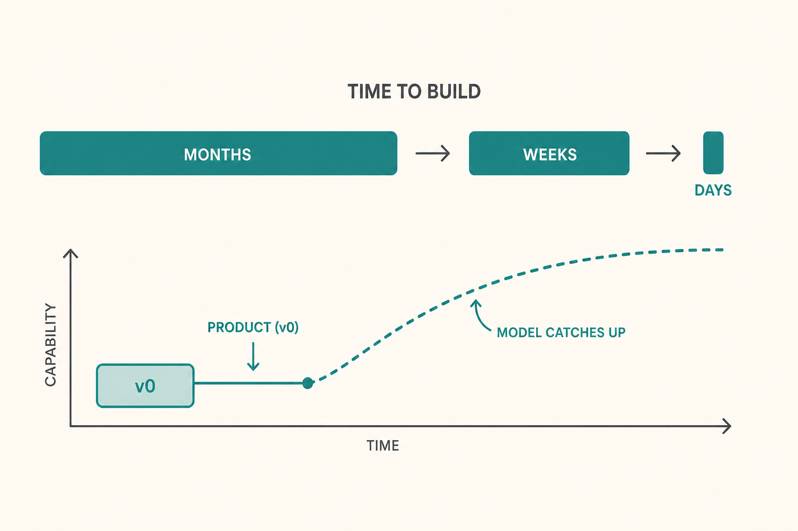

# Ship incomplete bets, then wait for the model

**Source:** Lenny Rachitsky (@lennysan), 23 Apr 2026
**Post:** https://x.com/lennysan/status/2047377335406694431

## What it claims

Anthropic’s cadence went months → weeks → days. Cat Wu’s punchline: build products that don’t fully work yet, then wait for the model to catch up. Hiring is shifting away from classic PM skills toward taste, evals, and being the right amount of AGI-pilled. 95% automation is not automation.

## Why it matters for a PO

Your job stops being backlog admin. You pick the bet, define “good enough to ship,” and write the eval — not the 18-month roadmap of features the model will make free.

## 3 takeaways

1. Cadence is a product decision. If discovery still takes a quarter, you are the bottleneck.
2. Ship the shape of the product before the capability exists. The model is the delivery team.
3. A leftover 5% of manual work is still a full product, with full cost.

## Practice this week

Pick one backlog item that only works if a model/API gets better. Write a 5-line eval of “done,” ship a v0 that fails it on purpose, and date when you’ll re-run the eval.
