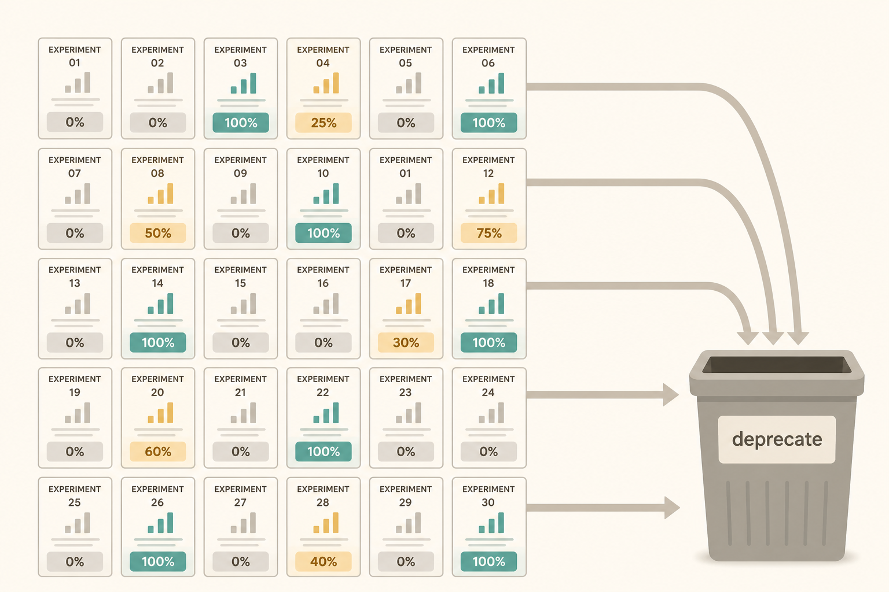

# Delivery includes deprecation

**Source:** Cat Wu (@_catwu), 28 May 2026
**Post:** https://x.com/_catwu/status/2060054180379689074

## What it claims

Claude Code “dynamic workflows” let you name a workflow and get an orchestration plan that actually runs in order — including across hundreds of agents. Cat used it to catalogue hundreds of A/B flags, find the ones stuck at 0% or 100%, and deprecate them in under 10 minutes in parallel.

## Why it matters for a PO

Shipping is the easy half. Stale experiments, leftover flags, and zombie configs are silent product. Using AI to *remove* work is a PO skill, not an engineering side quest.

## 3 takeaways

1. 0% and 100% flags are decisions you already made. Leaving them in the system is new risk.
2. Parallelise the hygiene, not just the build.
3. Trust comes from a plan the tool cannot skip — not from a longer prompt.

## Practice this week

List every experiment, feature flag, or “temporary” config you know of. Mark each 0 / partial / 100. Kill or schedule one stale 0% or 100% item by Friday.
