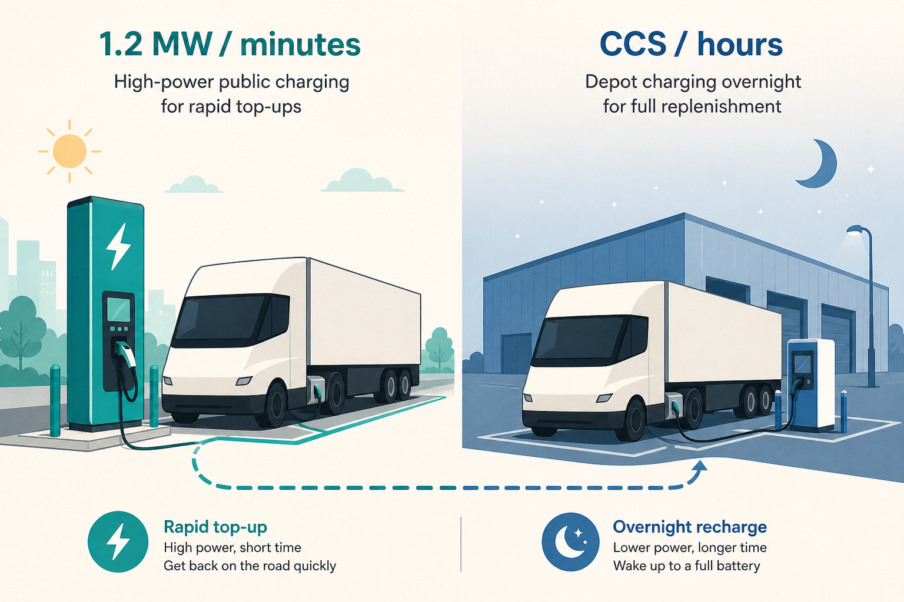

# Corridor megawatt vs depot CCS is the product split

**Source:** Sawyer Merritt (@SawyerMerritt), 17 Jul 2026; official note from Tesla Charging
**Post:** https://x.com/SawyerMerritt/status/2077964549123170309
- Official note: https://x.com/TeslaCharging/status/2078163491354292356

## What it claims

Tesla opened the first public Megacharger in Bloomington, CA: 6 stalls, 1.2 MW peak each, Tesla Semi customers. Public, corridor, minutes — not overnight depot.

## Why it matters for a PO

Fleets do not buy “a charger.” They buy a day in the life: depot fill at night (CCS, hours) vs en-route top-up (MCS-class, minutes). Once public megawatt exists, the customer question changes from “will this exist?” to “when is it on *our* corridors?” Don’t invent a Siemens roadmap from this — treat it as a market fact you have to explain.

## 3 takeaways

1. Spec the job, not the plug: minutes on a highway vs hours at a yard.
2. Six stalls is a product too: queueing, uptime, who can use it.
3. Official map drops are sparse and still move buyers. Your comms can be short if the artifact is real.

## Practice this week

Draw one fleet’s Tuesday: depot overnight + one public top-up. Write the two jobs in one sentence each (power, time, who pays). Take that to your next stakeholder chat instead of a feature list.
