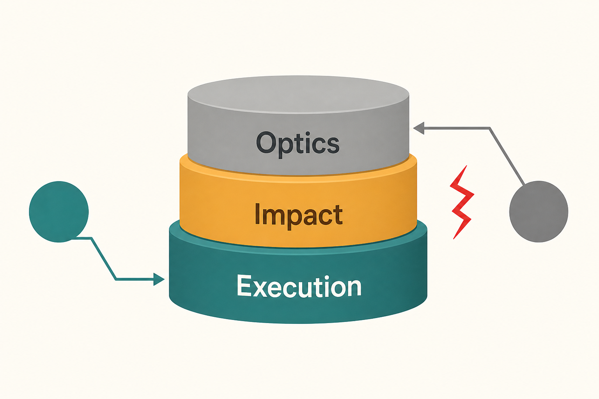

# Name the level before you argue the ticket

**Source:** Shreyas Doshi (@shreyas), 12 Mar 2021
**Post:** https://x.com/shreyas/status/1370248637842812936

## What it claims

Product work has three levels: Execution, Impact, Optics. Conflict is usually two people stuck on different levels — PM on impact vs team on execution, or PM on optics vs team on impact.

## Why it matters for a PO

Fleet ops lives in execution (“did the charger come up”). Leadership lives in impact (“did uptime move”). Sales/comms lives in optics (“can I say we launched”). If you litigate story points, you never notice you’re in different rooms.

## 3 takeaways

1. Start reviews with “which level are we on?” It ends half the fights.
2. Optics is not fake — it’s a different job. Don’t moralise it; schedule it.
3. If you only reward on-time sprints, you trained the room for execution.

## Practice this week

In one meeting, write Execution / Impact / Optics on a notepad. Tick where each speaker is. If two ticks disagree, say that out loud before discussing the ticket.
