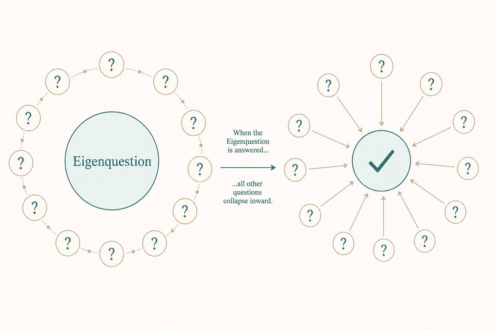

# Find the eigenquestion before the options

**Source:** Shreyas Doshi (@shreyas), Aug 2020
**Post:** https://x.com/shreyas/status/1293973551167373312

## What it claims

For a high-stakes decision, most debate is downstream. The eigenquestion (from Shishir Mehrotra) is the one answer that makes the other questions easy. Netflix example: TVOD vs SVOD wasn’t “how big is the catalog?” — it was “do we care more about catalog size or consumption friction?” Spend half the time on the question.

## Why it matters for a PO

Steering committees love three options and a recommendation. You end up litigating details. Corridor vs depot, interoperability vs time-to-market, custom vs standard — those only resolve if you name the one tradeoff that matches strategy.

## 3 takeaways

1. A beautiful options slide with the wrong question still ships the wrong thing.
2. The eigenquestion must be answerable from vision, not from last week’s metric.
3. It feels slow. It’s faster than reconvening.

## Practice this week

Take one live decision. Write every question on the table. Circle the one that, if answered, kills most of the others. Open the next review with only that sentence.
