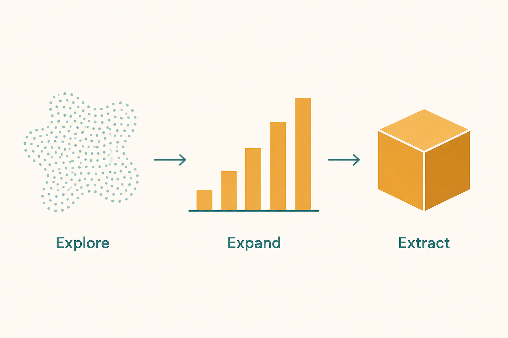

# Don’t mix Explore with Extract

**Source:** Shreyas Doshi (@shreyas) on Kent Beck’s 3X, May 2021
**Post:** https://x.com/shreyas/status/1399042778613485578

## What it claims

A product is in Explore, Expand, or Extract. Almost every important decision should account for the stage. Frameworks don’t save you — they name the context so you stop using extract-stage process on explore-stage work.

## Why it matters for a PO

A pilot and a scale-out need different evidence, different WIP, different stakeholder promises. If you run a new corridor behaviour through a mature-depot playbook (or the reverse), the team looks slow and the exec looks reckless. Same people, wrong stage.

## 3 takeaways

1. Explore: cheap tests, kill rate is a feature. Extract: reliability is the product.
2. Expand is the messy middle — process has to grow with volume, not copy extract too early.
3. Say the stage in the first line of a review. It licenses the plan that follows.

## Practice this week

Label three things in your world Explore / Expand / Extract. For the Explore one, cut one “scale” requirement (SLA, full i18n, extra report) that only belongs in Extract.
