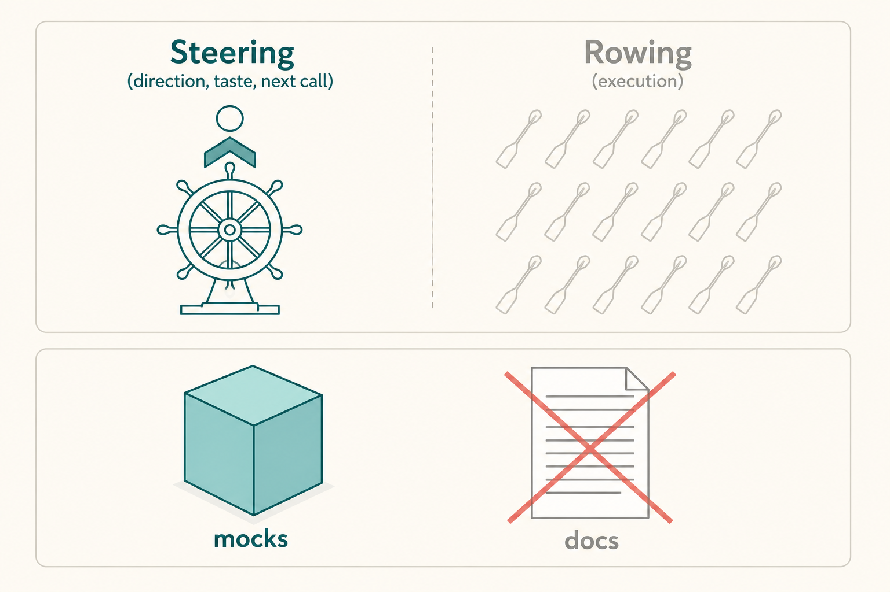

# Steering, not rowing

**Source:** Lenny Rachitsky (@lennysan), 31 Aug 2026
**Post:** https://x.com/lennysan/status/2094444052204998908

## What it claims

OpenAI’s ChatGPT Work lead Tara: the future of work is steering (taste, next call), not rowing. Build for where models will be in 2–3 months. PMs elevate ambition. Share mocks not docs. Never automate writing-as-thinking. Someone still has to be the DRI. Speed without a hypothesis compounds error.

## Why it matters for a PO

As execution gets cheaper, the PO job is hypothesis, taste, and a name on the outcome. Long docs stop being a signal of rigor. A 70% artifact plus a DRI beats a perfect spec with no owner.

## 3 takeaways

1. Build 2–3 months ahead of the model, not 12.
2. Mocks and A/B results communicate better than strategy novels.
3. Never outsource the writing you think with; automate the reporting.

## Practice this week

This week, replace one status doc with a mock or a 70% note. Put a DRI on the outcome in the first line.
