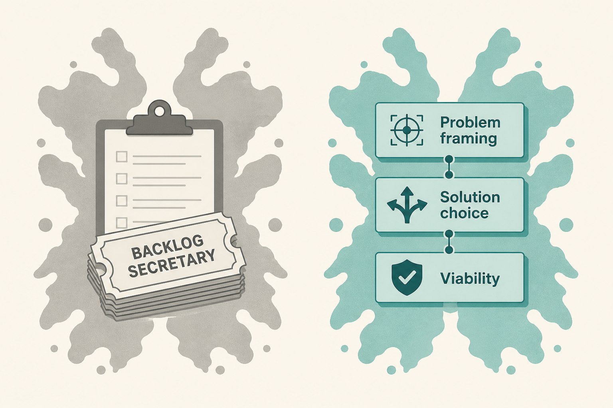

# PO is not a backlog secretary

**Source:** Scrum.org (@Scrumdotorg), 31 Aug 2026
**Post:** https://x.com/Scrumdotorg/status/2094576068724158861

## What it claims

How a candidate defines the product role names the operating model they came from, not their skill. Missing problem framing, solution choice, and viability together is the tell. Role behaviour follows the funding model. POs are not backlog secretaries; they are strategic leaders.

## Why it matters for a PO

If your week is “supplying ready work,” you inherited an order-taker model. PSPO-level work is finding worthwhile problems and solutions customers choose — including whether the thing is viable.

## 3 takeaways

1. The Rorschach test: backlog vs worthwhile problems.
2. Problem + solution + viability must sit with the PO, not get split away.
3. Funding model trains the behaviour; name it if you’re stuck supplying tickets.

## Practice this week

In one sentence, write your job this sprint as either “owning the backlog” or “choosing a worthwhile problem.” If it’s the first, pick one problem this week you will frame before any story is written.
