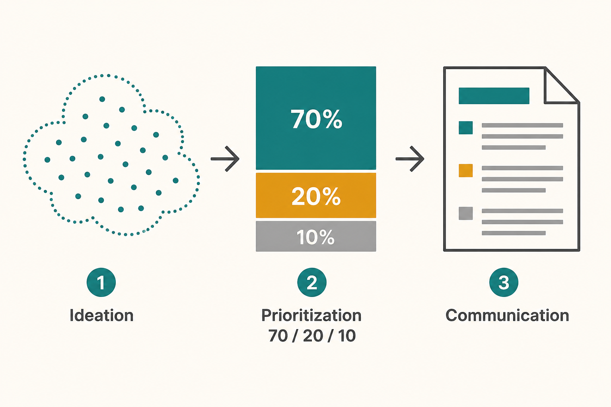

# Build a roadmap in three phases (70/20/10)

**Source:** Lenny Rachitsky (@lennysan)
**Post:** https://x.com/lennysan/status/1134212303732129792

## What it claims

A roadmap is not a list of ideas. Run three phases — ideation, prioritization, communication — over 1–3 weeks. Ideation: gather ideas from the team and stakeholders, collect them in one doc, vote (vote is one input, not the decision). Prioritization: score expected impact, resources, and risk; sort by ROI; then apply a 70/20/10 split (about 70% low-risk immediate impact, 20% risky long-term bets, 10% delight). Take a second pass for team favorites, strategic bets, and sequencing; tie the list to a winning strategy; convert to a conservative Gantt. Communication: team first, then stakeholders, then one visible source of truth. Refresh quarterly unless reality forces an earlier change. Research and data belong in every phase.

## Why it matters for a PO

POs are often asked for “the roadmap” before they have a process, and skipping ideation or strategy produces a Gantt of whoever shouted last. The 70/20/10 split plus a conservative capacity view is a concrete way to say no without looking political.

## 3 takeaways

1. Never skip ideation → prioritization → communication.
2. 70/20/10 beats a flat “priority stack.”
3. The roadmap is a living single source of truth, not a slide deck.

## Practice this week

Put every committed and proposed item into one sheet, tag each 70 / 20 / 10, and mark anything that has no line to a stated strategy.
