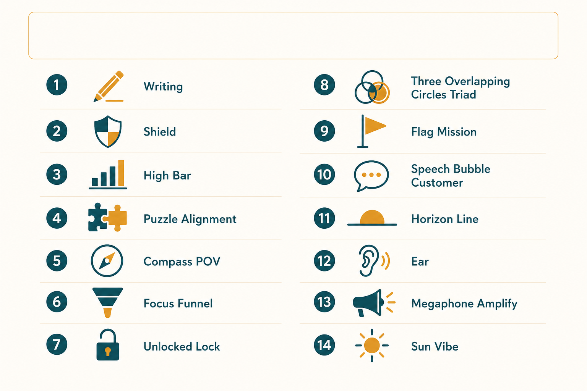

# 14 habits of highly effective PMs

**Source:** Lenny Rachitsky (@lennysan)
**Post:** https://x.com/lennysan/status/1389611792741986305

## What it claims

Effective PMs are judged first on communication: clear, concise docs, emails, meetings. They project “I’ve got this,” hold a high bar, hunt misalignment, and always have a point of view — loosely held. They ruthlessly prioritize (focus is the gift), unblock constantly, and run a tight PM–EM–DM triad so the team hears one voice. They reconnect work to mission, talk to customers regularly, anticipate what’s around the corner, make sure quieter people are heard, amplify others’ wins, and set the team’s vibe as de-facto leader.

## Why it matters for a PO

PO failure is rarely “wrong Jira hygiene”; it is dropped balls, fuzzy writing, and a triad that disagrees in public. These habits are a weekly operating system, not a promotion rubric.

## 3 takeaways

1. Writing quality is how people judge thinking.
2. Highest-leverage work is restoring alignment and unblocking.
3. POV + customer contact + triad unison beats being a coordinator.

## Practice this week

Pick one recurring meeting; rewrite the pre-read to half the length, state your POV in one sentence, and list the open misalignment you will close in the room.
