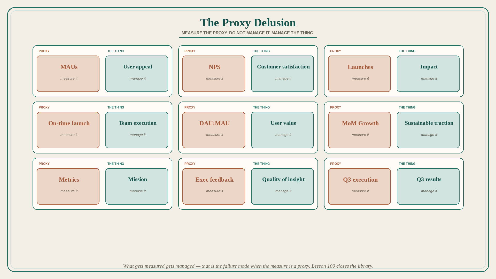

# The Proxy Delusion: measure the proxy, do not manage it

**Source:** Shreyas Doshi (@shreyas)
**Post:** https://x.com/shreyas/status/1412942226150232064

## What it claims

Clear product thinking is essentially about telling the proxy for a thing apart from the thing itself. The proxy is just a proxy; it is not the thing itself; it is not the end goal. By all means measure the proxy, but don’t manage the proxy. Examples: Metrics – Mission; On-time launch – Team execution; MAUs – User appeal; DAU:MAU – User value; NPS – Customer satisfaction; MoM Growth – Sustainable traction; Exec feedback – Quality of insight; Q3 execution – Q3 results; Launches – Impact. What gets measured gets managed, and therein lies the problem. Turning a proxy into the main goal is the root cause of idiocy in organizations (only a slight exaggeration).

## Why it matters for a PO

Story points, on-time PI, NPS, and launch counts are proxies. Managing them (gaming velocity, shipping on the date, chasing a survey) replaces mission, execution quality, satisfaction, and impact. Lesson 100 is the close of the library: keep the thing, measure the proxy.

## 3 takeaways

1. Write the pair: proxy vs. the thing; manage the thing.
2. On-time launch ≠ execution; launches ≠ impact; NPS ≠ satisfaction; metrics ≠ mission.
3. “What gets measured gets managed” is the failure mode when the measure is a proxy.

## Practice this week

For the current PI objective, write “[proxy] – [the thing]” for the metric on the slide. In standup, ask one question about the thing (mission, value, impact) that the metric cannot answer. Do not add a new KPI this week.
