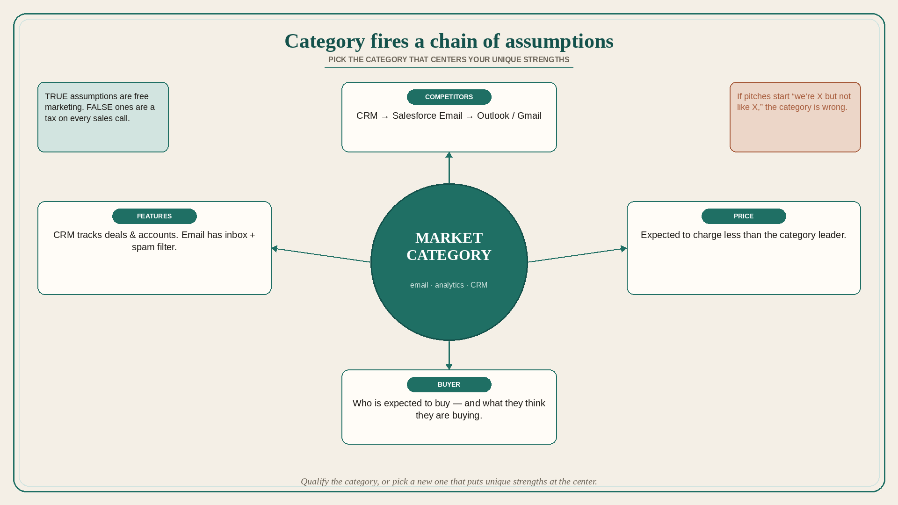

# Your market category fires a chain of assumptions; pick the one that centers your strengths

**Source:** April Dunford (@aprildunford)
**Post:** https://x.com/aprildunford/status/1135942950503034881

## What it claims

Declaring a category — “email” / “analytics” / “CRM” — first tells customers who your competition is (CRM → Salesforce; email → Outlook/Gmail). Customers also assume features from the category (CRM tracks deals and accounts; email has an inbox and spam filtering). Category also sets price and expected buyer (a CRM is expected to charge less than Salesforce, the leader). If those triggered assumptions are true, you save work: you do not list every feature, and you do not name competitors explicitly. If they are false, marketing and sales spend significant effort undoing damage the positioning already did. You can qualify the category (a CRM for banks is not expected to have every Salesforce feature) or decide the product has outgrown the category. If sales spend a lot of time backing out — “We’re email but not like any email you have ever seen” — you might be better as chat or team collaboration. The best category puts unique strengths at the center so they are obvious to best-fit prospects.

## Why it matters for a PO

Backlog fights about “are we a portal, a platform, or an ops console?” are category fights. A wrong default category makes every pitch start with un-teaching. The PO should notice when sales or CS spend the first ten minutes saying what the product is not.

## 3 takeaways

1. Category implies competitors, features, price, and buyer — whether you intended that or not.
2. True assumptions are free marketing; false ones are a tax on every sales call.
3. If pitches start with “we’re X but not like X,” the category is wrong.

## Practice this week

Write the category you currently use. List the assumptions it triggers (competitor, must-have features, price band, buyer). Mark true / false. If two or more are false, propose one alternative category that puts a real strength in the center.
