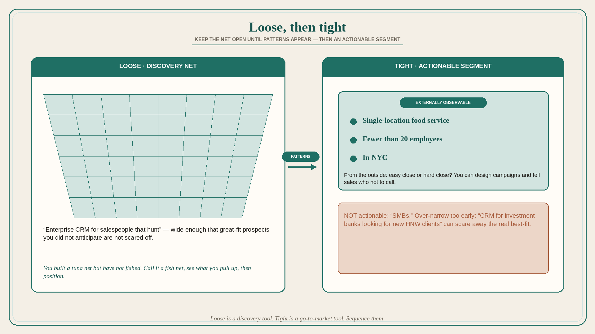

# Keep positioning loose until patterns appear, then tighten to an actionable segment

**Source:** April Dunford (@aprildunford)
**Post:** https://x.com/aprildunford/status/1120760058688737285

## What it claims

Positioning with no (or few) customers is different from positioning after traction: new companies should keep it loose; once they have traction they must tighten. Great positioning answers: What is this thing? Who is it for? Why should we care? Early on those are unvalidated working assumptions. Restrictive early positioning — “CRM for investment banks looking for new HNW clients” — can scare away great-fit prospects you did not anticipate; looser positioning — “Enterprise CRM for salespeople that hunt” — keeps the net open. Analogy: you built a tuna net but have not fished; calling it a tuna net and going only where tuna are can catch nothing; call it a fish net, see what you pull up, then position — maybe the tuna net is a better cod net. Once patterns of who loves you and why appear, tighten to best-fit customers. Segmentation must be actionable: from the outside, can you tell whether a prospect will be easy to close? “SMBs” is not; “single-location food service businesses with fewer than 20 employees in NYC” is — you can design campaigns, give sales a list, and tell them who not to call. Early on, do not over-invest in positioning until patterns exist.

## Why it matters for a PO

New modules and new markets get locked to a slide-deck ICP before anyone has used the thing. The PO’s job is to run wide enough to see who actually loves it, then tighten to a segment you can say yes/no to from the outside.

## 3 takeaways

1. Loose positioning is a discovery tool; tight positioning is a go-to-market tool — sequence them.
2. Over-narrow ICP before evidence scares off the real best-fit.
3. If you cannot point at a company and say “easy close / hard close,” the segment is too broad.

## Practice this week

Write today’s ICP in one sentence. Rewrite a looser version for discovery and a tighter, externally observable version for sales. List three live accounts and mark which sentence they actually match.
