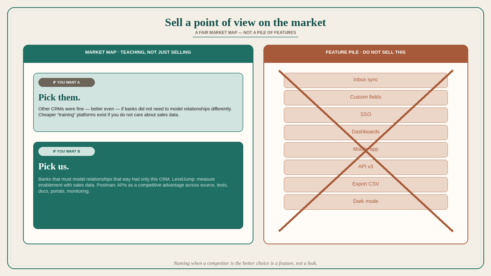

---
filters:
  topic:
    - positioning
  format: principle
  source: april-dunford
---

# Sell a point of view on the market, not a pile of features

**Source:** April Dunford (@aprildunford)
**Post:** https://x.com/aprildunford/status/1263842747531788290

## What it claims

Startups pitch features when they could sell a point of view: why features were prioritized that way, and why the product is best for a certain type of buyer. A good sales story maps the market and positions competitors as well as you: “If you want A, pick Competitor X; if you want B, pick us.” Fair positioning filters bad-fit prospects and is useful to customers. Most business buyers have never bought in your market; they do not know how to filter. A fair market map is teaching, not just selling. Examples: CRM for banks — banks needed to model relationships differently; other CRMs were fine (better even) if you did not need that, and they were the only choice if you did. LevelJump: sales enablement success should be measured with sales data; if you do not care, cheaper “training” platforms exist. Postman: APIs can be a competitive advantage and need a view across source, tests, docs, portals, monitoring; if you do not value excellent APIs, there are other ways to build them. Helping prospects know when to choose you and when to choose competitors is education, and done fairly it is valuable for everyone.

## Why it matters for a PO

Feature-list roadmaps train sales to recite capabilities. A PO who can say “pick them for A, pick us for B” gives the team a filter for which deals and which backlog items belong.

## 3 takeaways

1. POV explains the why of the feature set; the list does not.
2. Naming when a competitor is the better choice is a feature, not a leak.
3. Teaching the market is how you stop chasing bad-fit demand.

## Practice this week

Write one sentence: “If you want A, pick [competitor]; if you want B, pick us.” Share with the trio. Cut or park one backlog item that only serves A.

## Also from

- **April Dunford (@aprildunford)**, [original post](https://x.com/aprildunford/status/1349820125998948352) (merged from lesson 173): You know it is the right story when it helps first-time buyers choose their criteria and build a shortlist. Comparison sites only label leaders and challengers, market insight is scarce, and about 4 in 10 purchases end in “no decision.” Drop the “customer has a problem, we are the hero” movie script; tell your point of view on which customer types should pick which approach, without bashing competitors.
