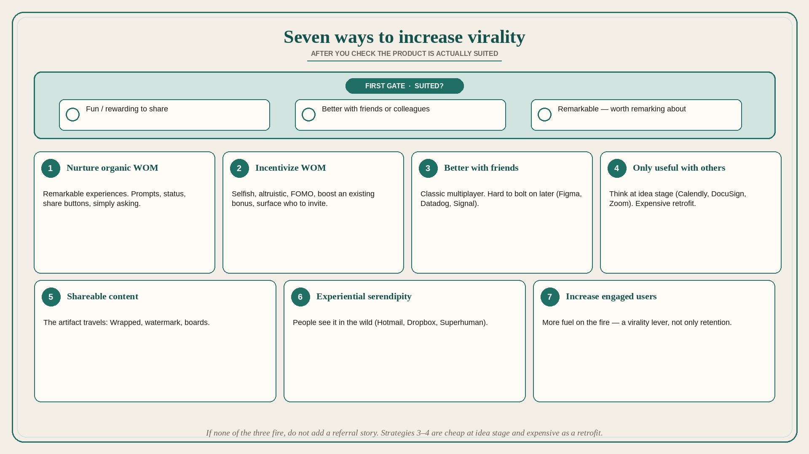

# Seven ways to increase virality — after you check the product is suited

**Source:** Lenny Rachitsky (@lennysan)
**Post:** https://x.com/lennysan/status/1361495041986883585

## What it claims

Seven ways: (1) nurture organic WOM, (2) incentivize WOM, (3) make the product better with friends/colleagues, (4) make it only useful with friends/colleagues, (5) generate shareable content, (6) increase experiential serendipity, (7) increase engaged users. First gate: the product is suited if it is innately fun or rewarding to share, better with friends/colleagues, or remarkable (worth remarking about). Organic WOM is driven by remarkable experiences (Tinder, Clubhouse, Airbnb, Levels); prompts include creating a remarkable experience, giving it to high-follower non-users, status (invite-only), share buttons, and simply asking. Incentives: selfish (free money/storage), altruistic (save a friend money), FOMO (limited invites), boosting an existing bonus, surfacing incentives, helping users know who to invite. Better-with-friends is classic and hard to bolt on later (Figma, Datadog, Snapchat, Signal, LinkedIn). Only-useful-with-others is even harder after the fact, think at idea stage (Calendly, DocuSign, Zoom). Shareable content: Spotify Wrapped, TikTok watermark, Pinterest. Experiential serendipity: people see it in the wild (Citizen, Hotmail, Tinder, Superhuman, Dropbox). Increasing engaged users puts more fuel on the fire (Facebook People You May Know, photo tags, TikTok duets).

## Why it matters for a PO

B2B industrial software rarely “goes viral,” but several of the seven still apply: better-with-colleagues (shared depot/operator workflows), only-useful-with-others (scheduling, handover, invites to a counterpart), serendipity (an operator sees a sister site using it). The gate stops the team funding a referral program for a product that is not remarkable or multiplayer.

## 3 takeaways

1. Do not invest in virality until the product is actually suited (remarkable or multiplayer).
2. Strategies 3–4 are structural; they are cheap at idea stage and expensive as a retrofit.
3. More engaged users is a virality lever, not only a retention metric.

## Practice this week

Score the product 0/1 on the three “suited” checks. If none fire, do not add a referral story. If one fires, pick a single strategy (3, 4, 5, or 6) and write one backlog experiment that would increase it.
