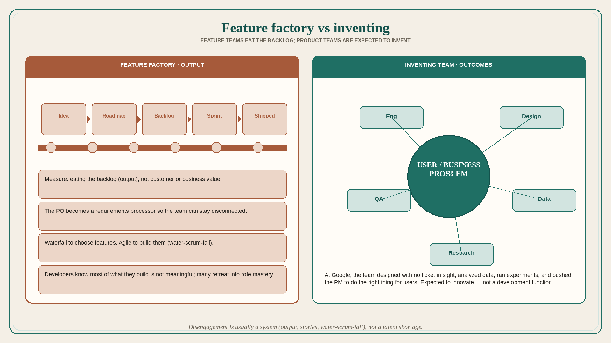

# Feature factories disengage developers; product teams are expected to invent

**Source:** Itamar Gilad (@itamargilad)
**Post:** https://x.com/itamargilad/status/1564185155438366720

## What it claims

At Google, developers (engineers, designers, QA, data, research) were engaged: they designed features with no ticket in sight, analyzed data, replied in forums, ran experiments, and pushed the PM to do the right thing for users. Many companies report the opposite: disengaged developers, committed to engineering projects and Scrum rituals, not the business. Gilad rejects a pure quality-gap story (Big Tech people are just better); he meets good people everywhere — the difference is the company. At Google, product teams are not a development function; they are expected to innovate and invent. Feature-factory companies add features to the roadmap, move them to a backlog, and measure the team on “eating the backlog” (output), not customer or business value (outcomes). Feature teams are not expected to solve business and user problems, so they disconnect; the PM (now Product Owner) is supposed to process it all into detailed user-story requirements. Combined with Scrum as a way to push more bits faster: waterfall to choose features, Agile to build them (water-scrum-fall). Developers know most of what they build is not meaningful; many retreat into role mastery. Transformation requires an uncomfortable change for everyone.

## Why it matters for a PO

The PO title is named in the anti-pattern: becoming the requirements processor so the team can stay disconnected. The PO’s lever is to stop measuring the sprint on backlog-burn and start sharing user/business problems with the trio.

## 3 takeaways

1. Disengagement is usually a system (output, stories, water-scrum-fall), not a talent shortage.
2. If only the PO “owns” the problem, the team cannot invent.
3. Delivery-as-the-metric trains people to eat the backlog, not to care whether it mattered.

## Practice this week

In refinement, present one item as a user/business problem with no solution attached. Ask engineering and design what they would try. Do not write the story until they have proposed at least two options.
