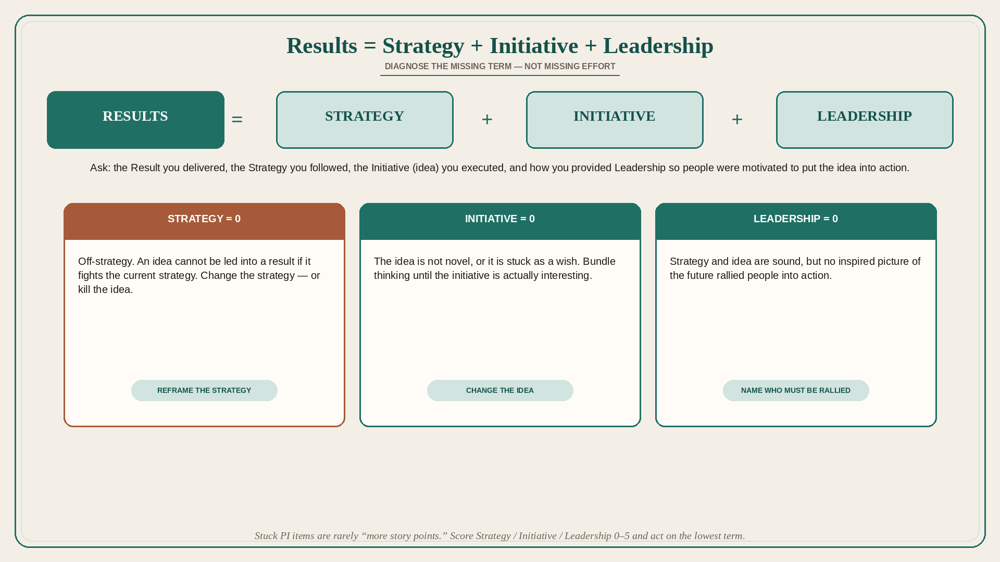

# Results = Strategy + Initiative + Leadership

**Source:** Gibson Biddle (@gibsonbiddle)
**Post:** https://x.com/gibsonbiddle/status/1485328995776401409

## What it claims

Biddle’s interview question and leadership model: Results = Strategic thinking + Initiative + Leadership. Ask: describe how you delivered a Result, the Strategy you followed, the Initiative (idea) you executed, and how you provided Leadership so people were motivated to put the idea into action. Case: at The Learning Company (1998), a PM, Greg, wanted an exclusive Pokemon children’s-software deal. TLC believed in heavy-hitting learning value; Pokemon was seen as bad for kids from a learning point of view. There were no results — Greg was stuck; the idea was off strategy; it was not novel; he needed to bundle thinking to lead. He advocated a new strategy, “Learning Games”: not every TLC game needed heavy pedagogy; take what kids love and add small “good for you” learning. The initiative improved: card-shaped Poke-roms kids could collect, capitalizing on Pokemon cards and the fact that CD-ROMs need not be round. Leadership then became simple: a long-term exclusive, a line of Poke-roms that nominally fit TLC learning objectives and the Pokemon brand. Result: that year’s top-selling kids software. In interviews, listen for whether the result is important and metric-backed, whether the idea is novel, and whether leadership was an inspired vision that rallied people. Use the same model when initiatives are stuck: which term is missing — strategy, idea, or leadership?

## Why it matters for a PO

Stuck PI items are rarely “we need more story points.” Name which term is zero: off-strategy, uninteresting idea, or no one rallied. The Pokemon case is a reposition of the strategy so a blocked initiative could ship.

## 3 takeaways

1. Diagnose stuck work as missing Strategy, Initiative, or Leadership — not missing effort.
2. An off-strategy idea cannot be led into a result; change the strategy or kill the idea.
3. Leadership here means motivating action with a picture of the future, after strategy and idea are sound.

## Practice this week

Pick one stuck initiative. Score Strategy / Initiative / Leadership 0–5. Write one sentence on the lowest term and one action (reframe strategy, change the idea, or name who must be rallied) for this week.
