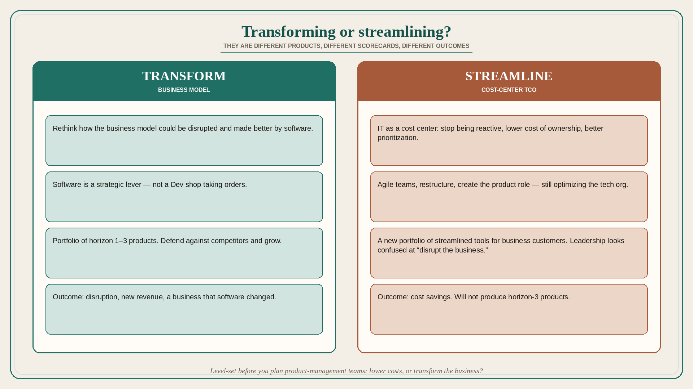

# Ask whether you are transforming or streamlining; they are different products

**Source:** Melissa Perri (@lissijean)
**Post:** https://x.com/lissijean/status/1368564803724251139

## What it claims

If you are not rethinking how the business model could be disrupted and made better by software, you are not doing a product “transformation.” Perri works with “software-enabled” enterprises that do not primarily sell software: banks, insurance, pharma, manufacturers. They typically ran traditional IT: the business tells tech what tools to build; tech is a Dev shop / services org — reactive, not strategic. Twenty years later: thousands of tools, no usage insight, massive tech debt; they “transform” with agile teams, restructure, and create the product role. Leadership outcomes she hears are cost-centered because IT is a cost center: streamline products, stop being reactive, lower cost of ownership, better prioritization. She asks how the transformation will disrupt the business; they look confused — they are making a new portfolio, streamlining for business customers. That optimizes tech teams; it is not transformation. Older enterprises get disrupted because they do not treat software as a strategic lever on the business model. You do not have to stop serving business needs; use a portfolio of horizon 1–3 products. Usually no one in leadership saw a true transformation, and there is no clear strategy (even at the business) for software to align to. Software leaders fear saying no to business requests. Before planning how to build product-management teams, level-set: transforming or streamlining? Lower costs, or transform the business? Different approaches, different outcomes: cost savings vs defending against competitors and growing.

## Why it matters for a PO

In a large industrial software-enabled org, most “agile transformations” are streamlining with product titles. The PO should know which game leadership is actually playing, so the backlog is not asked to deliver disruption on a cost-center scorecard.

## 3 takeaways

1. Streamlining IT and transforming the business model are different strategies; name which one you are in.
2. Cost-center outcomes (lower TCO, better prioritization) will not produce horizon-3 products.
3. No business strategy means product teams cannot be “strategic” no matter how good the process is.

## Practice this week

Write one sentence: “This quarter we are streamlining X / transforming Y.” If it is streamlining, pick one backlog item that is honest cost/quality work and stop selling it as disruption. If it is transforming, name the business-model change and one horizon-2/3 bet that serves it.
