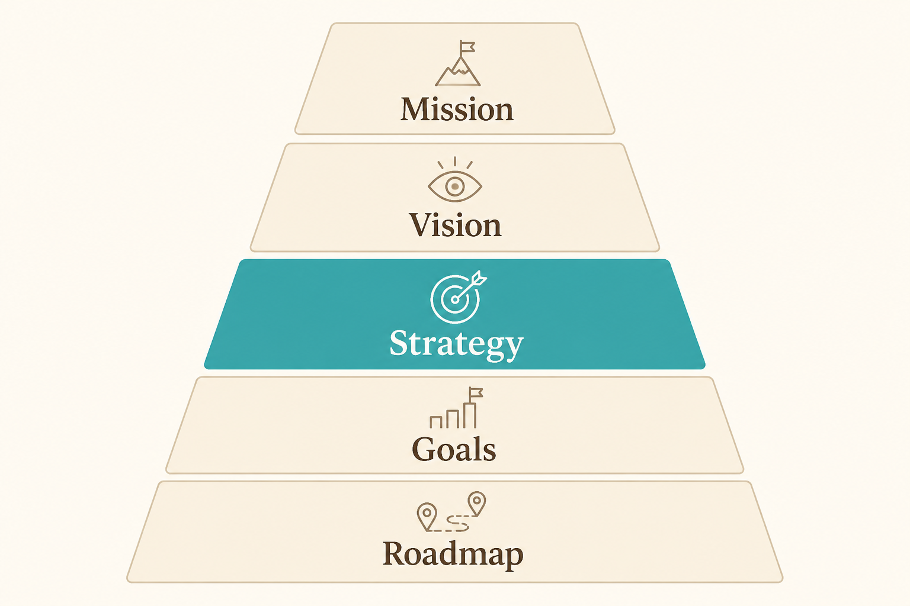

# Strategy sits between vision and goals

**Source:** Lenny Rachitsky (@lennysan)
**Post:** https://x.com/lennysan/status/1303356480842682368

## What it claims

Strategy is not the roadmap. The cascade is Mission (what we are trying to achieve) → Vision (what it looks like when we’ve achieved it) → Strategy (how we will achieve it) → Goals (how we will measure progress) → Roadmap (what we should build). If you cannot say how you will win, the roadmap is just a backlog.

## Why it matters for a PO

Stakeholders will treat a sprint plan as strategy unless the PO can show the missing “how we win” layer. Separating strategy from goals and from the roadmap stops feature-as-strategy debates.

## 3 takeaways

1. Roadmap without strategy is a pile of good ideas.
2. Goals measure the strategy; they are not the strategy.
3. Write strategy as a document others can argue with, not a slide.

## Practice this week

One page: Mission / Vision / Strategy / current Goals / next-quarter Roadmap themes — and delete any roadmap item that does not support the strategy sentence.
