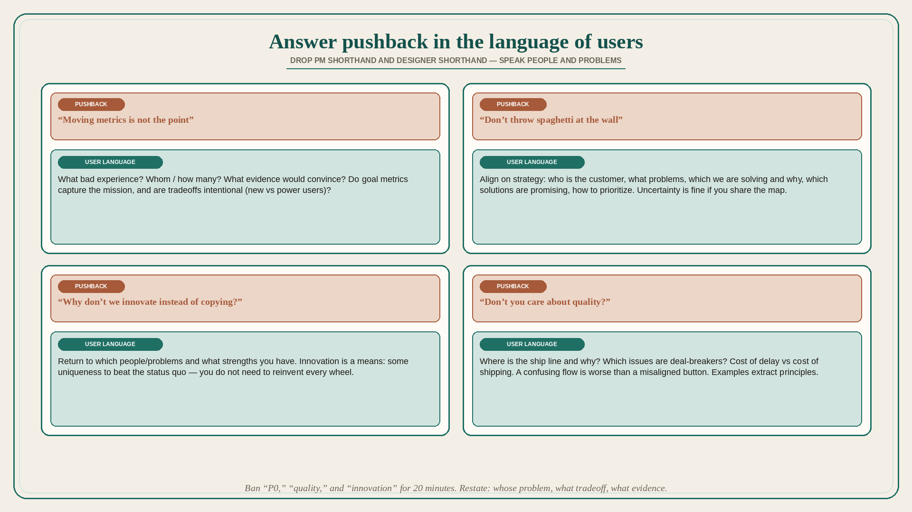

# Answer designer pushback in the language of users, not PM shorthand

**Source:** Julie Zhuo (@joulee)
**Post:** https://x.com/joulee/status/1503452971752849409

## What it claims

Four designer pushbacks and how PMs can respond. (1) “Moving metrics is not the point” — said when something tests well but feels like a bad UX; root causes: goal metrics miss the harm, or it is fine for most and bad for some. Do not argue whether metrics are the point; ask what bad experience, whom/how many, what evidence would convince. Alignment: do goal metrics capture the mission, and are tradeoffs intentional (new users vs power users)? (2) “Don’t throw spaghetti at the wall” — skepticism the ideas will work, the list is too long, or the bigger goal is unclear. Align on strategy: who is the customer, what problems, which we are solving and why, which solutions are promising and why, how to prioritize. Uncertainty is fine if you share the same high-level map. (3) “Why don’t we innovate instead of copying?” — fear of shortcutting exploration, or that fast-follow is unrewarding. Return to which people/problems and what strengths you have. Innovation is a means, not an end: some uniqueness is required to beat the status quo; you do not need to reinvent every wheel. (4) “Don’t you care about quality?” — felt incorrect tradeoff vs metrics, speed, or a decision-maker. Align with real examples: where is the ship line and why, which quality issues are deal-breakers, what metrics miss. A confusing flow is worse than a misaligned button; whether to delay launch depends on the cost of delay vs the cost of shipping with the issue — real examples extract principles. Fastest alignment: speak the common language of users; drop PM shorthands (metrics, ship date, P0/P1) and designer shorthands (quality, innovation, consistency).

## Why it matters for a PO

Trio fights are usually shorthand fights. Translating “P0 / this quarter / the metric moved” into people, problems, and intentional tradeoffs is the PO’s alignment job.

## 3 takeaways

1. Do not defend metrics in the abstract; name the user harm, who is hit, and what evidence would change the call.
2. Spaghetti complaints are usually a missing strategy map, not a missing feature list.
3. Quality and innovation debates resolve with examples and principles, not slogans.

## Practice this week

In one design review, ban “P0,” “quality,” and “innovation” for 20 minutes. Restate the disagreement as: whose problem, what tradeoff, what evidence. Write the principle you actually used to decide.
