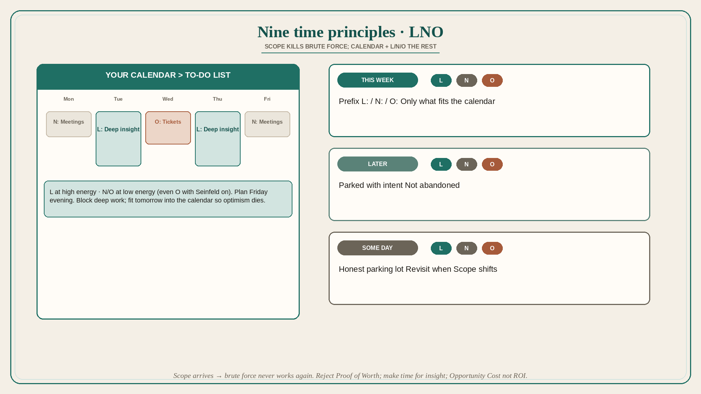

# Nine time principles: scope kills brute force; LNO the rest

**Source:** Shreyas Doshi (@shreyas)
**Post:** https://x.com/shreyas/status/1492345140492472321

## What it claims

Lack of time is a perpetual PM stressor; conventional systems leave PMs short. Nine principles: (1) Brute force works early, then Scope arrives and it never works again — throw the old playbook away. (2) A calendar speaks more truth than a to-do list: block deep work, limit meetings, plan the next day at close of day, fit tomorrow’s tasks into the calendar so optimism dies, plan next week Friday evening. (3) Tasks are Leverage / Neutral / Overhead — prefix L: / N: / O:; spend less on N/O and more on L; match energy. (4) Proof of Worth tasks (SQL, code check-ins, support, always taking notes) earn the room early but become a trap; leaders should not require them of senior PMs. (5) Eisenhower fails when the top half is still impossibly long; Radical Delegation with a contract handles the rest. (6) Greatest leverage is insight; schedule Placebo Productivity before a deep-work day and change place so the brain leaves meeting-mode. (7) Goal is minimize Opportunity Cost, not positive ROI. (8) Make time to grow (10–20% of career time to skills; even 2–5% beats 0). (9) Stack-rank life priorities; winning the PM job while losing life is not worth it. Operating system: THIS WEEK / LATER / SOME DAY, prefixed L/N/O, planned Friday evening.

## Why it matters for a PO

PO calendars fill with refinement, PI planning, and “just one more SQL.” Brute-force heroics that worked on a small module fail at train scope. LNO + calendar truth + dropping Proof of Worth is how a PO protects insight and strategy instead of drowning in notes and tickets.

## 3 takeaways

1. Once Scope hits, working harder is the wrong playbook; the calendar, not the to-do list, is the constraint.
2. Prefix work L/N/O and match energy; stop requiring Proof of Worth past junior levels.
3. Block insight work (Placebo Productivity + change of place); spend 2–20% of career time getting better so you can create time.

## Practice this week

On Friday, rebuild next week as THIS WEEK / LATER / SOME DAY. Prefix every THIS WEEK item L/N/O. Block one deep-work session for an L insight task; move two O items to low-energy slots or delete them.
