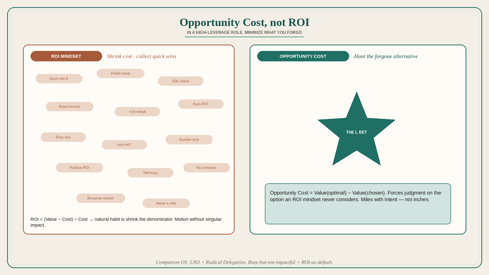

# In a high-leverage role, minimize opportunity cost, not ROI

**Source:** Shreyas Doshi (@shreyas)
**Post:** https://x.com/shreyas/status/1409726218438549514

## What it claims

In a high-leverage role, stop doing work that merely provides a positive ROI; start focusing on work that minimizes opportunity cost. Hundreds of things will create more value than the cost of your time — you should not do most of them. ROI = (Value created − Cost of your time) ÷ Cost of your time, so an ROI mindset can raise value or shrink cost; people naturally shrink cost, occupying the day with quick incremental wins. Opportunity Cost = Value of optimal option − Value of chosen option. Reprogramming for opportunity cost forces judgment: explore very high-value alternatives an ROI mindset would never consider. The well-meaning always-busy person whose many completions never add up to a singular long-term impact is the ROI mindset in the wild. ROI motion is Brownian — inches without cohesion; Opportunity Cost aims to move by miles. LNO and Radical Delegation are the companion operating systems. Among the highest-value perspectives Doshi has to offer: more impact and more balance.

## Why it matters for a PO

Almost every refinement item is “positive ROI.” That is why the backlog is a Brownian cloud of quick wins. A PO who asks “what is the opportunity cost of this sprint’s mix?” is forced to name the one L bet that should have been on the calendar instead of three N polish tickets.

## 3 takeaways

1. Positive ROI is the wrong bar in a high-leverage role; hundreds of worthy tasks still should not be yours.
2. ROI thinking shrinks cost and collects quick wins; opportunity-cost thinking hunts the option you are forgoing.
3. Busy-but-not-impactful teams are a symptom of ROI-as-default, not of missing hours.

## Practice this week

List everything the trio plans to touch this sprint. Star the one item whose forgone alternative would hurt most if you skipped it. Cut or defer two positive-ROI items to fund that one.
