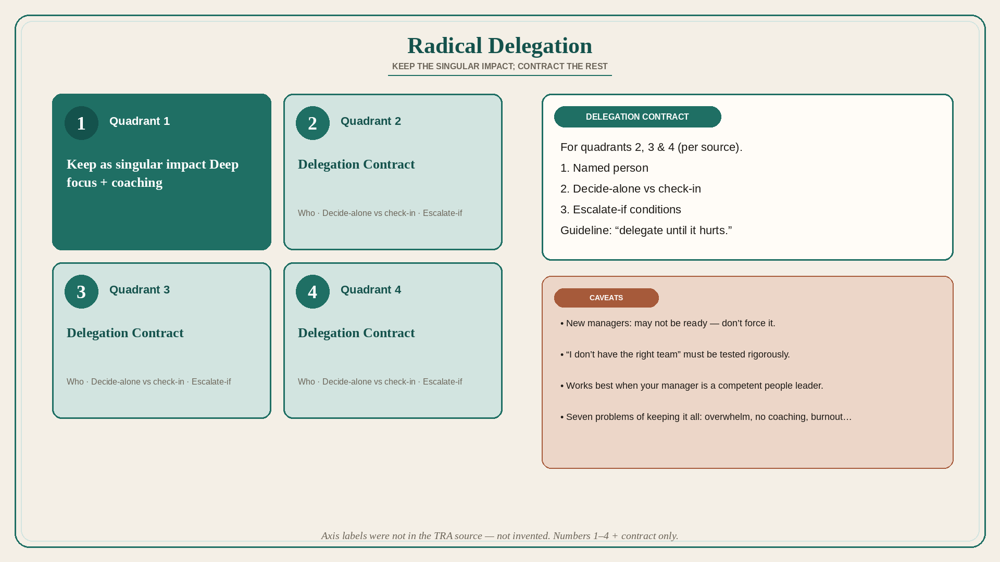

# Radical Delegation: keep the singular impact, contract the rest

**Source:** Shreyas Doshi (@shreyas)
**Post:** https://x.com/shreyas/status/1401598910792011776

## What it claims

Radical Delegation is how a leader makes a major singular impact, truly empowers people, grows them with stretch tasks, creates flow, and avoids burnout — game-changing for leaders and teams who are ready. It starts after you have already discarded work you should not pay attention to; what remains is still a lot, and most leaders take it all on. Many leaders take work in each of four quadrants (especially 1, 2, 3) because the work “rightly” landed on their plate and is “usually” done by the leader (example: “If it’s a meeting with my peer, I must go”). That mindset produces seven problems: leaders overwhelmed; unavailable to the team; weak coaching; good people not stretched; whack-a-mole work; important work undone; burnout. Radical Delegation makes you intentional about the singular impact (highest-leverage work with deep focus, plus coaching) and creates a Delegation Contract for quadrants 2, 3, and 4. Caveats: new managers may not be ready; “I don’t have the right team” must be tested rigorously; it works best when your manager is a competent people leader. Guideline from replies Doshi endorses: “delegate until it hurts.” Axis labels for the four quadrants were not in the TRA source and are not invented here.

## Why it matters for a PO

POs often “must” attend every architecture, customer, and sister-train meeting. That is quadrant-habit, not physics. A Delegation Contract (who goes, what they can decide, when they escalate) is how the PO keeps coaching and the one L bet instead of becoming the meeting.

## 3 takeaways

1. After you have already said no to junk work, the remainder still cannot all be yours.
2. “I must go because it is a peer meeting” is a default, not a law; it produces the seven burnout problems.
3. Write a Delegation Contract for the work you will not keep; it fails if you are too new, lying about the team, or reporting to a manager who cannot read the move.

## Practice this week

List the meetings and decisions on your plate. Mark which you will keep as the singular impact. For one you will not keep, write a three-line Delegation Contract (person, decide-alone vs check-in, escalate-if) and send it before the next occurrence.
