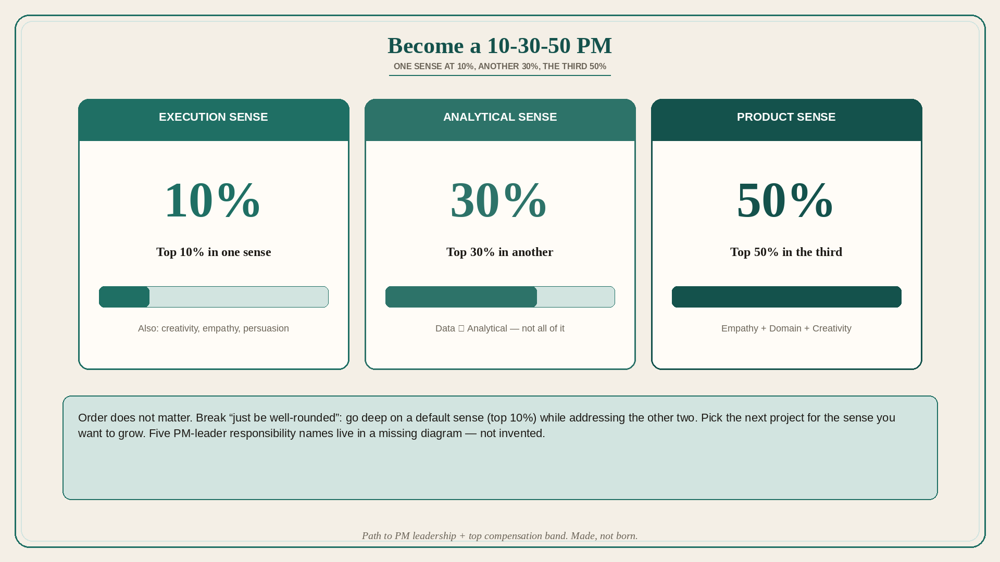

# Become a 10-30-50 PM: one sense at 10%, another 30%, the third 50%

**Source:** Shreyas Doshi (@shreyas)
**Post:** https://x.com/shreyas/status/1055718652102594560

## What it claims

Reframe “How can I get to manage Product Managers?” to “How do I become an effective product leader?” You must check three boxes: impact (past), competence (present), potential (future). Grow by alternately increasing unique impact and product scope; the manager seat follows credibility + enough scope. Three essential senses: Execution, Analytical, Product. Data is part of Analytical sense, not the whole. Great execution also needs creativity, empathy, and persuasiveness. Become a 10-30-50 PM: top 10% in one sense, top 30% in another, top 50% in the third (order does not matter). 10-30-50 PMs are made, not born; break “just be well-rounded” by going deep on a default sense while addressing the other two. Product Sense = Empathy + Domain Knowledge + Creativity. Prefer priority/core products; run toward hard projects; reframe “whom can I manage?” to “whom can I mentor?”; do horizontals. Hardest new-manager shift: Creating → Editing. A Rabois-adapted confidence × impact map: manager time belongs in high-impact / not-high-confidence. About 3 things should be done flawlessly per day/week/month/year as an individual (~5 team, ~7 company). Five PM-leader responsibility names live in a missing diagram and are not invented.

## Why it matters for a PO

PO growth is not “more Jira hygiene.” It is which sense is the 10%, whether the next PI is chosen to grow a weak sense, and whether the trio knows which decisions they own vs which they bring. The 3/5/7 “flawless things” list is a better PI contract than a 40-item committed PI.

## 3 takeaways

1. Grow by alternating unique impact and scope; the manager seat follows credibility + enough scope, not a request to “manage PMs.”
2. Pick a default sense for top-10% (Product / Analytical / Execution) and choose projects that grow the others; Product Sense = empathy + domain + creativity.
3. Draw the confidence × impact boxes with the trio; manager time belongs in the high-impact / not-high-confidence cell, and only ~3 things get flawless effort.

## Practice this week

Score yourself 10 / 30 / 50 across Execution, Analytical, Product Sense. Name next quarter’s one project that grows the weakest sense. Draw the six-box decision map with the trio and mark which live decisions sit in which box.
