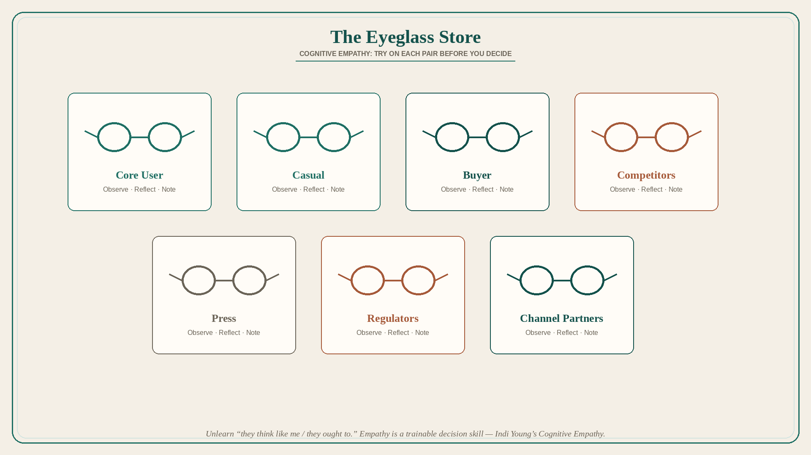

# Cognitive empathy is a product superpower: use the Eyeglass Store

**Source:** Shreyas Doshi (@shreyas)
**Post:** https://x.com/shreyas/status/1291764637545816065

## What it claims

Empathy is the most valuable product skill: vital for correct product decisions, useful from strategy to UI copy, and crucial in execution. Like magic, it can be learned. Build it: basics of psychology, behavioral economics, and cognitive biases; be an objective observer of org situations; spend time with customers — prioritize quality of insight over quantity of facts; ask more “why” than “what/how.” The greatest impediment is the self: unlearn “everyone thinks like I do” and “everyone may not, but they ought to.” Metaphor: the Eyeglass Store. In a product debate, try on glasses for Core User, Casual User, Buyer, Competitors, Press, Regulators, Channel Partners; for each, observe, reflect, note. Wire it in from pricing strategy down to one sentence in a blog post. This thread is specifically Cognitive Empathy (Indi Young’s types). Extra tactics: listen; use your own product; use competitors’; shadow sales/support; beginner’s mind.

## Why it matters for a PO

Backlog fights are usually one pair of glasses (the vocal buyer, the last exec visit, the team’s own workflow). The Eyeglass Store is a 15-minute facilitation move that surfaces Core vs Casual vs Buyer vs Regulator before the trio writes acceptance criteria.

## 3 takeaways

1. Treat cognitive empathy as a trainable decision skill, not a personality trait.
2. Unlearn “they think like me / they ought to”; that is the real blocker.
3. Run the Eyeglass Store on live decisions — Core, Casual, Buyer, Competitor, Press, Regulator, Channel — then write the hypothesis from the whys.

## Practice this week

Take one in-flight story. Spend 15 minutes in the Eyeglass Store with the trio (at least Core User, Buyer, and one internal stakeholder). Rewrite the story’s “why” from the glasses that disagree.
