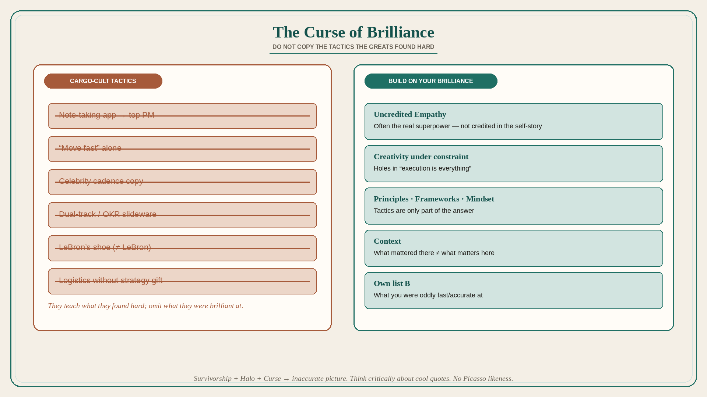

# The Curse of Brilliance: do not copy the tactics the greats found hard

**Source:** Shreyas Doshi (@shreyas)
**Post:** https://x.com/shreyas/status/1442165948417392642

## What it claims

People hear “Amateurs talk strategy. Professionals talk logistics” (and similar quotes) and conclude they should ignore abstract work and copy the tactics of The Great Ones. That conclusion is flawed. Doshi’s mid-career “ideas don’t matter; execution is everything” conviction came from mature Google products where the visible contribution was getting things done amid wild complexity. Two flaws: (1) context — what mattered there is not universal; (2) self-assessment holes — chiefly User Empathy (an off-the-charts superpower he did not credit) plus Creativity under constraint. The Curse of Brilliance: when dissecting success, people overemphasize what they found very difficult and underplay what they were naturally brilliant at. Hence “speed is all that matters” from founders who take vision for granted. Survivorship bias and the Halo Effect join the Curse; you dutifully “move fast” and go nowhere. In PM, the analog is tool obsession: no note-taking app makes you a top PM. Remedy: the brilliant should share the real contributors; the rest should treat tactics as only part of the answer — Principles, Frameworks, and Mindset — and identify their own brilliance rather than “be like somebody.”

## Why it matters for a PO

Transformation slideware copies the tactics of famous product orgs (dual-track, OKRs, discovery sprints) without the unstated superpowers those orgs already had. A PO should ask “what is our brilliance, and what are we cargo-culting because someone else found it hard?” before adopting another tool or cadence.

## 3 takeaways

1. People teach what they found hard and omit what they were brilliant at; copying those tactics is how you “move fast” and go nowhere.
2. Context + uncredited empathy/creativity beat “execution is everything.”
3. Build around your own brilliance; tactics, tools, and celebrity-PM habits are not the job.

## Practice this week

Write two lists for your last successful delivery: (A) what felt brutally hard, (B) what you were oddly fast/accurate at (empathy, constraint-creativity, stakeholder translation). Share B with the trio. Drop one copied tactic this sprint that was on list A for someone else and is not actually your constraint.
