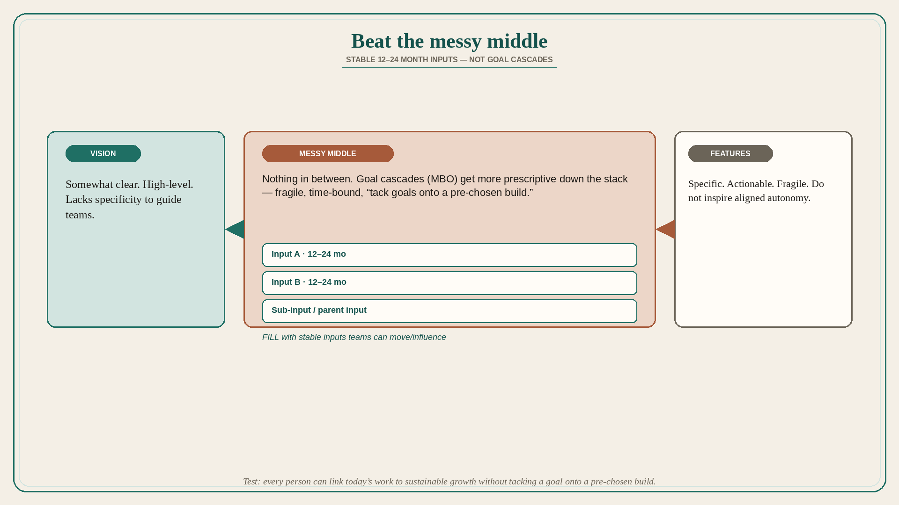

# Beat the messy middle: stable 12–24 month inputs, not goal cascades

**Source:** John Cutler (@johncutlefish)
**Post:** https://x.com/johncutlefish/status/1642599899064852480

## What it claims

The “messy middle” is one of the biggest impediments to product success: strategy and vision are somewhat clear, teams have specific features they are working on, and there is nothing in between. High-level visions lack the specificity to guide teams; specific project-based roadmaps feel actionable but are fragile and do not inspire aligned autonomy. You need a linking mechanism. Goal cascades are the classic MBO problem: goals get more specific and prescriptive down the stack, they are time-bound, they are fragile, and they foster “figure out what you want to build AND THEN tack on goals.” The trick is a stable set of inputs teams can work to move/influence over 12–24 months. In North Star workshops the hard part is not the perfect North Star metric; it is the inputs — and in some cases sub-inputs or parent inputs. Every team member should be able to link their work to sustainable growth in a coherent, stable way. When you can do that, you have beaten the messy middle.

## Why it matters for a PO

PI planning often jumps from a vision slide to a feature list. The missing object is a 12–24 month input (activation of a workflow, quality of a data set, cycle time of a diagnosis) that the team can influence without a fragile project roadmap or a cascaded OKR invented after the features were picked.

## 3 takeaways

1. Vision-plus-features with nothing in between is the messy middle; project roadmaps and MBO cascades both fail as the link.
2. Prefer stable 12–24 month inputs (and sub-inputs) over a perfect North Star number.
3. The test: every person can link today’s work to sustainable growth without tacking a goal onto a pre-chosen build.

## Practice this week

Write the current vision in one sentence and the current sprint features in a list. Fill the gap with 2–3 inputs the team can move over 12–24 months. Re-tag one sprint item as “moves input X,” or drop it if it cannot.
