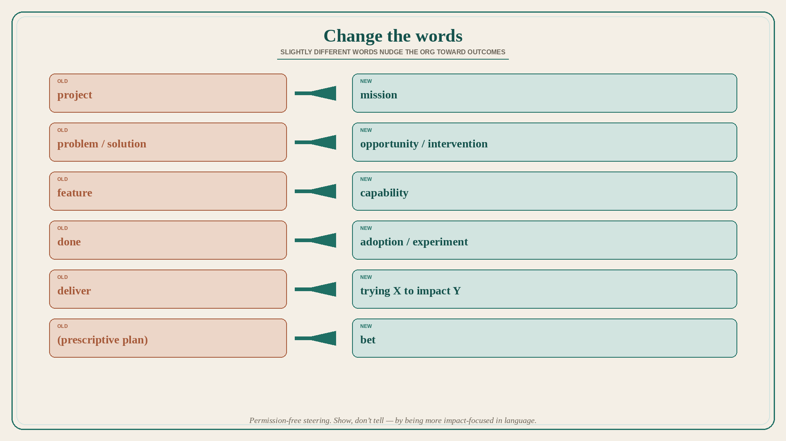

# Change the words: mission, bet, opportunity, intervention, capability

**Source:** John Cutler (@johncutlefish)
**Post:** https://x.com/johncutlefish/status/1070500483087781888

## What it claims

Words matter. Slightly different words can nudge the organization in a new direction if they take hold. Replace “project” with “mission” — a mission feels more outcome-oriented. Use “bet”: you can attach it even to something highly prescriptive — bet conveys uncertainty, value, investment, information. Prefer “opportunity vs. intervention” over problem vs. solution: problem conveys binary solving; intervention feels experimental; opportunity feels valuable. Stop shipping “features”; start delivering “capabilities” or “accelerators” — capability implies something new is possible and implies use; feature sounds like a checkbox. Kanban hack: “done” is almost certainly not done — you have entered adoption or you are running an experiment; change the column. Phrasing: instead of “deliver,” say “trying” — “we’re trying ______ to see if it will impact ______, which we believe will impact ______.” These are things you can do without asking for permission. By being more impact-focused in language, you show, not tell.

## Why it matters for a PO

The PO writes the words on the board and in the PI objective. “Project / feature / done / deliver” silently trains the train toward output. Swapping in mission / bet / opportunity / intervention / capability / trying is a permission-free steering move.

## 3 takeaways

1. Mission and bet import outcome and uncertainty without a process rollout.
2. Opportunity vs intervention beats problem vs solution; capability beats feature-as-checkbox.
3. Relabel “done” as adoption/experiment, and phrase work as “trying X to impact Y.”

## Practice this week

Rewrite one PI objective and two backlog titles using mission/bet/opportunity/intervention/capability. Change the board’s right-most column from Done to Adoption or Measuring. Use the “trying X to impact Y which we believe impacts Z” sentence in standup for five days.
