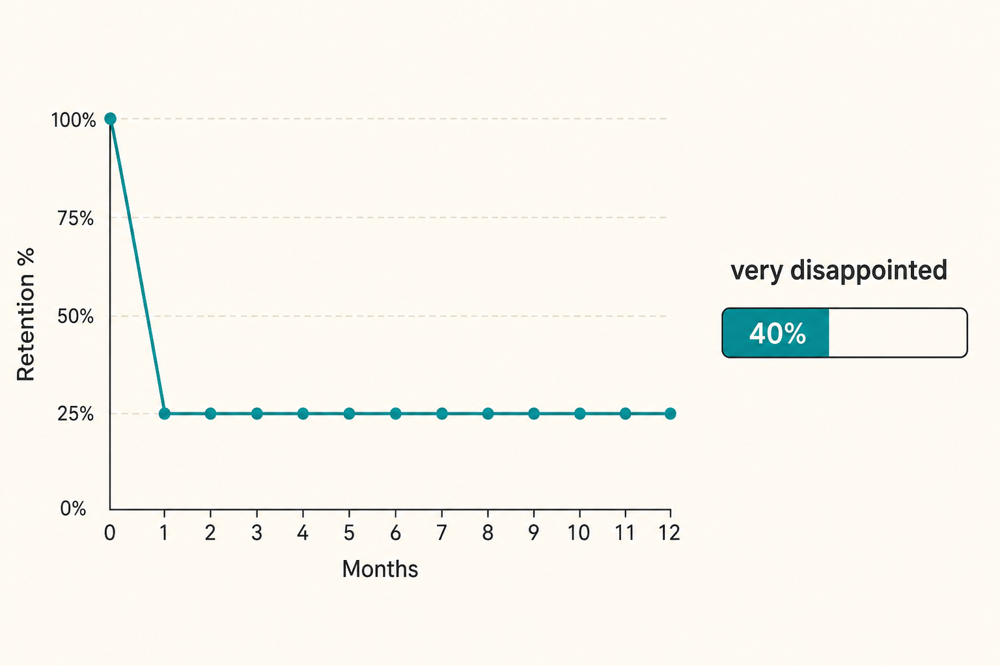

# Ten tests for product/market fit

**Source:** Lenny Rachitsky (@lennysan)
**Post:** https://x.com/lennysan/status/1220008309798760449

## What it claims

PMF is not a vibe you declare. Concrete tests include: cohort retention that flattens; >40% “very disappointed” if they could no longer use it; consumer exponential organic WOM; pull the free trial and they scream; acquire customers for less than they are worth, repeatably; demand outruns your ability to serve; people stay even when the product is broken. Horowitz: PMF is not a one-time trumpet. Ev Williams: fit is multi-dimensional (segment × use case), not binary. Almost none of these work pre-product.

## Why it matters for a PO

POs get pressure to scale or add features while retention has not flattened and users would not be very disappointed. These tests are a shared language to delay scale or to kill a bet.

## 3 takeaways

1. Flattening retention is the most operational test.
2. 40% very-disappointed is the survey bar.
3. Fit can be strong for one job/segment and absent for another — don’t average it.

## Practice this week

Pull one cohort retention curve and, if you have users, run the “how disappointed” question on a small sample; write one sentence: “We have / do not have PMF for [segment] × [job].”
