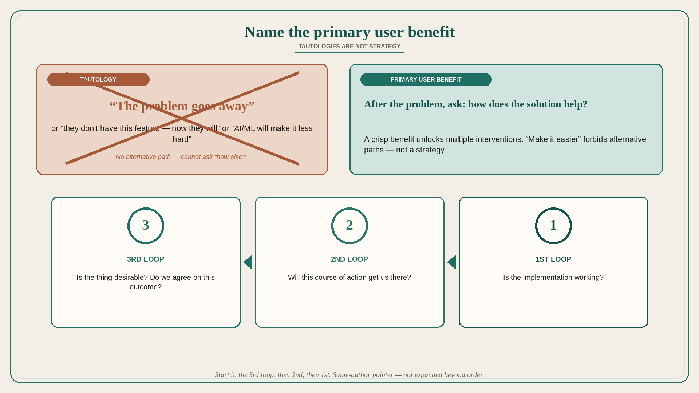

# Name the primary user benefit; tautologies are not strategy

**Source:** Pavel A. Samsonov (@PavelASamsonov)
**Post:** https://x.com/PavelASamsonov/status/1638224408832557057

## What it claims

The best way to explain “primary user benefit”: after articulating the problem, look at how you describe the solution and ask “how does it help?” People often realize the problem definition is not crisp enough to answer. Two common patterns: (1) the problem is that customers don’t have this feature, but now they will (not a real problem); (2) the solution is that customers will no longer have the problem because AI/ML (not a real solution). A key design function is imagining multiple solutions, which requires understanding the problem and the most important benefit before designing ways to deliver that benefit. When the solution is tautological, you cannot ask “how else might we deliver this benefit” because the benefit is articulated as “problem goes away” — there is no alternative path. That is also why “make it easier” is not a real product strategy. Related loop order (same-author pointer): start in the 3rd loop — is the thing we want desirable, do we agree to work toward this outcome? — then the 2nd — will this course of action get us there? — and only then the 1st — is the implementation working?

## Why it matters for a PO

Feature requests arrive as “users don’t have X” and as “make it easier / add AI.” Those are tautologies. A PO who forces “how does it help?” either gets a real primary benefit (and therefore alternative solutions) or exposes that the story is not ready for the sprint.

## 3 takeaways

1. After the problem statement, ask how the solution helps; if you cannot answer, the problem is not crisp.
2. “They don’t have this feature” and “AI will make the problem go away” are not a problem and a solution.
3. “Make it easier” is not a strategy because it forbids alternative paths to a named benefit.

## Practice this week

Take one committed story. Write: problem, proposed solution, primary user benefit as a non-tautological how it helps. If you cannot, park the story and list two alternative interventions that could deliver the same benefit.
