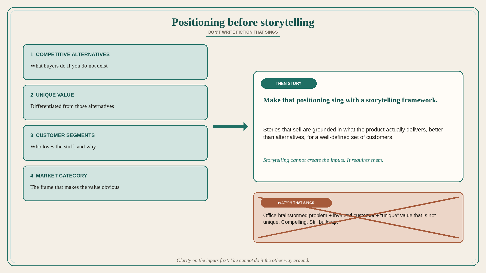

# Positioning before storytelling: don’t write fiction that sings

**Source:** April Dunford (@aprildunford)
**Post:** https://x.com/aprildunford/status/1254441815404658688

## What it claims

Positioning and storytelling/messaging are often confused; they are not the same. Starting with storytelling without working on positioning first is dangerous. Structured storytelling approaches (Dunford likes Building a Story Brand as one recent example) have components like “the problem,” where you start by describing what customers struggle with. All good storytelling structures assume you already have a tight definition of the target customer and the value you deliver to that buyer, that the value is differentiated from competitors, and that you know who those competitors are. A lot of companies do not know the exact problem they solve or the exact profile of the customer they solve it for — worse, they think they do, but it is fiction. You can brainstorm ideas in the office, use a structured process to build the story, and produce a very compelling story that is also absolute bullcrap, because the inputs (problem definition, customer profile, unique value) were fiction. Clarity on the inputs first — competitive alternatives, unique value, customer segments, market category (Positioning) — must come before the story. As with storytelling, a structured process is needed to determine those inputs for the product. Stories that sell must be grounded in what the product actually delivers, better than alternatives, for a well-defined set of customers; you need to know who loves the stuff and why. Storytelling frameworks cannot be used to determine positioning — they require positioning as an input. Once a positioning process gets you to the reality of who loves the stuff and why, you can make that positioning sing with a storytelling framework. You cannot do it the other way around.

## Why it matters for a PO

Pitch decks, PI themes, and “the narrative for leadership” get written first because they are easier than naming alternatives and who actually loves the product. A PO who lets the story lead will ship a compelling fiction: a problem no real buyer has, a segment that does not exist, unique value that is not unique. Positioning work is backlog work, not a marketing afterthought.

## 3 takeaways

1. Storytelling assumes positioning (customer, differentiated value, known alternatives); it cannot create those inputs.
2. A structured story built on office-fiction inputs is still bullcrap, however compelling.
3. Work competitive alternatives → unique value → segments → category, then make that positioning sing.

## Practice this week

Before the next narrative review, write the four positioning inputs on one page (alternatives, unique value, who loves it and why, category). Strike any sentence in the current story that is not grounded in those inputs.
