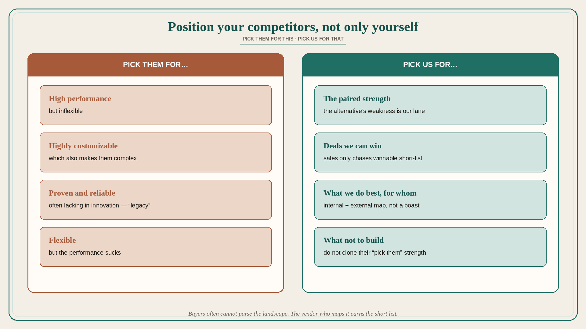

# Position your competitors, not only yourself

**Source:** April Dunford (@aprildunford)
**Post:** https://x.com/aprildunford/status/1200541017155473408

## What it claims

Positioning your offering in a market sets up who the competition is and why you are a better choice for target buyers. Done really well, it also positions the competitors. In B2B, buyers have often never purchased a solution like yours and struggle to make sense of what they should pay attention to and what they can ignore; helping them do that is valuable and often essential to getting on a short list. Vendors know the solution landscape better than buyers. Telling them, for example, “these solutions are high performance but inflexible and these other ones are flexible but the performance sucks” is valuable precisely because most vendors will not do it. While you position your offering, you can position competitors as well: they might be “highly customizable,” which also makes them “complex”; “proven and reliable” is often also lacking in innovation (“legacy” is the “OK Boomer” of enterprise IT-speak). Startups often shy away from talking about competitors, but if you know customers are evaluating them, give context. The sales team should have the confidence to say “Pick them for this and pick us for that” and only chase deals they can win. Strong positioning helps everyone internally and externally understand what you do best and for whom; done smartly, it also shines a light on competitors’ weaknesses.

## Why it matters for a PO

Competitive slides that only praise “us” leave buyers to invent the landscape. A PO who can say “pick them for X, pick us for Y” stops the trio chasing unwinnable deals and stops the backlog cloning every competitor feature. Positioning the alternative is how you choose what not to build.

## 3 takeaways

1. Buyers often cannot parse the landscape; the vendor who maps it earns the short list.
2. Every competitor strength has a paired weakness (customizable → complex; proven → legacy).
3. “Pick them for this, pick us for that” is a sales and backlog filter, not an insult.

## Practice this week

Name two alternatives a buyer will actually evaluate. For each, write one “pick them for…” and one “pick us for…”. Cut or defer one backlog item that only exists to clone their “pick them” strength.
