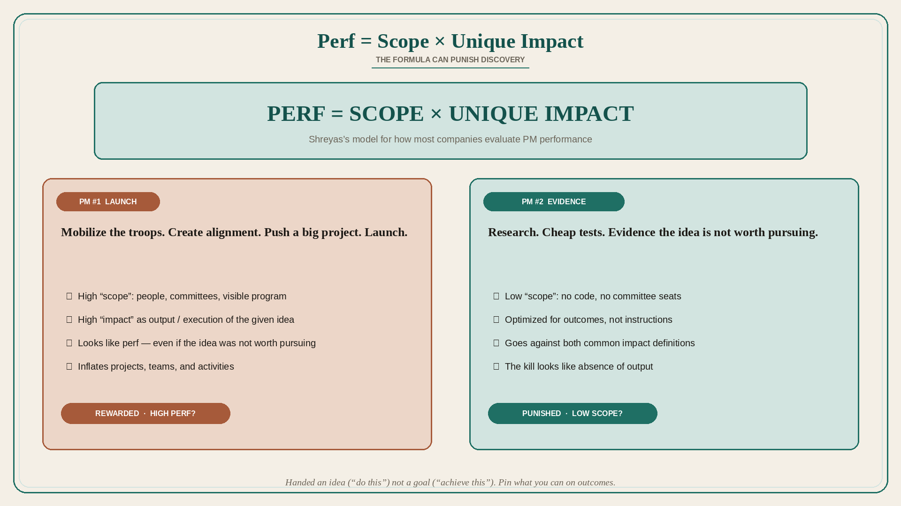

# Perf = Scope × Unique Impact — and the formula can punish discovery

**Source:** Itamar Gilad (@itamargilad)
**Post:** https://x.com/itamargilad/status/1565289016794152960

## What it claims

Measuring PM performance is tough. Scenario: two PMs are each given a big idea to run with. The first mobilizes the troops, creates alignment, pushes a big project forward, and launches. The second conducts research and comes back with evidence that the idea is not worth pursuing. Which is more likely to get a promotion? Two issues: the PMs are asked to pursue an idea (“do this”) rather than a goal (“achieve this”); as most ideas fail, it would have been better to let the PM and team pursue an outcome goal — but that is not how most companies work, so many PMs must “run with an idea.” The second question is what behavior the company motivates. Shreyas offers a useful model for how most companies evaluate PM performance: Perf = Product Scope × Unique Impact. Product scope can mean how much of the product is under your influence, how many people work on your ideas, and how many committees you sit on — a subjective measure that can motivate people to inflate projects, teams, and activities. In the example, PM #1 created a big, visible project (“high scope”); PM #2 evaluated the idea in cheap ways and came back with evidence rather than code (“low scope”). The wrong definition of scope can go against product discovery. “Impact” is even more subjective. In many companies high impact = high output: launching big, visible product changes, or driving big sweeping org changes. Another interpretation: high impact = great execution — a high-impact employee reliably executes the tasks given to them. PM #2 used neither definition: she optimized for outcomes and did not just follow instructions, again going against perf. A solution could be to pin impact and scope on outcomes, but outcomes are harder to measure and harder still to attribute to an individual (success has many fathers). Some companies will not see the point: they want strong executers that gratify their managers. Bigger problem: it is generally hard to measure the performance of an individual who (a) deals with a lot of uncertainty, (b) is dependent on other people to do the work, and (c) works in an org context he/she does not control — you might do everything right and still fail. Alternative PM perf criteria might be: how much do they know their stuff; how good are they to work with; do they use the right decision processes; do they consistently contribute to positive outcomes — none of this is clear-cut. Meta question: should we measure performance and “optimize” individuals, or do these things at the level of the org and its subparts — optimizing cogs in a machine, or helping imperfect people collaborate in a social organism?

## Why it matters for a PO

A PO who kills a bad idea in discovery looks “low scope.” A PO who inflates a PI with a visible program looks “high perf.” If reviews reward launch volume and committee seats, the backlog will fill with ideas-to-run-with instead of outcomes. The PO’s job includes making the kill visible as impact, not as absence of output.

## 3 takeaways

1. Being handed an idea (“do this”) rather than a goal (“achieve this”) is the setup that makes the wrong PM look successful.
2. Scope-as-headcount/committees and impact-as-output punish cheap evidence and reward inflation.
3. Individual PM scores are structurally noisy (uncertainty, dependence, context); pin what you can on outcomes, and question whether you are optimizing cogs.

## Practice this week

For one in-flight idea, write two review sentences: the launch story (PM #1) and the evidence-to-kill story (PM #2). Take the cheaper evidence path far enough to know whether the idea is worth a PI. If you kill it, put the evidence in the review, not only the absence of a launch.
