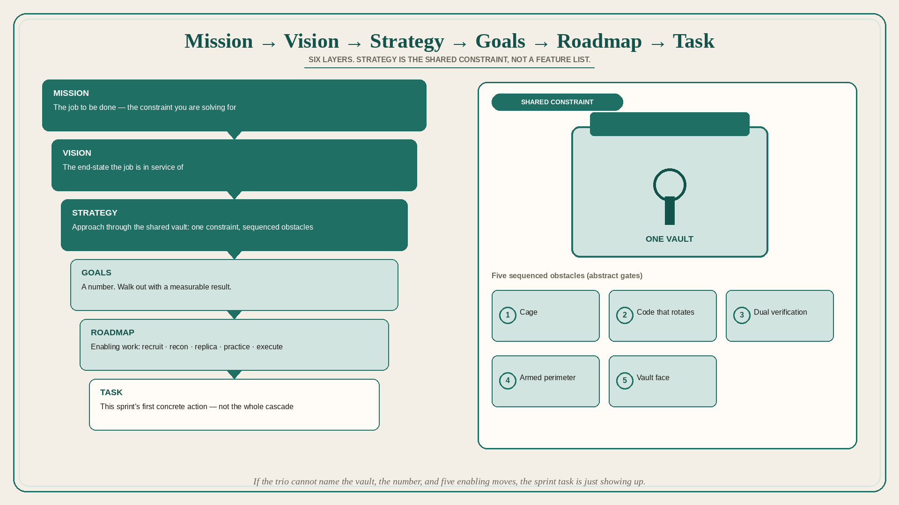

# Mission → Vision → Strategy → Goals → Roadmap → Task (Ocean’s 11)

**Source:** Lenny Rachitsky (@lennysan)
**Post:** https://x.com/lennysan/status/1362876502992252931

## What it claims

The cascade, as taught by Ocean’s 11: Mission → Vision → Strategy → Goals → Roadmap → Task. In the film mapping: Mission — rob the Bellagio, the Mirage, and the MGM Grand casinos, and get back at rival Terry Benedict. Vision — great wealth and revenge. Strategy — get into the vault that all three casinos share, then: (1) get into the casino cage; (2) get through doors with a code that changes every 12 hours; (3) get into an elevator that requires fingerprints + vocal verification; (4) get past two guards with uzis; (5) break into the vault. Goal — walk out with $150m. Roadmap — (1) recruit eight new colleagues; (2) do reconnaissance at the Bellagio; (3) create a precise replica of the vault; (4) practice maneuvering through security systems; (5) execute the plan. Task — arrive at the casino. The thread is the mapping itself; it does not add further product commentary.

## Why it matters for a PO

Backlogs often start at Task (“arrive at the casino”) with no shared Mission or Strategy. The Ocean’s 11 stack is a one-page test: if the trio cannot name the vault, the $150m, and the five roadmap moves, the sprint tasks are just showing up at the building. Alignment is the cascade, not a longer Jira description.

## 3 takeaways

1. Mission, vision, strategy, goals, roadmap, and task are different layers; collapsing them hides whether you are robbing three casinos or just arriving.
2. Strategy here is the approach through a shared constraint (one vault, five obstacles), not a list of features.
3. The roadmap is recruit / recon / replica / practice / execute — enabling work — not the goal itself.

## Practice this week

One page, six lines, for the current PI: Mission, Vision, Strategy (including the “shared vault” constraint), Goal (a number), Roadmap (five enabling moves), Task (this sprint’s first concrete action). If a backlog item does not serve a line, cut or recategorize it.
