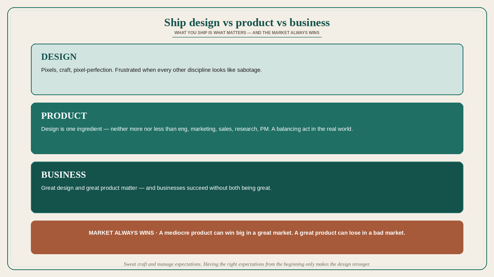

# Ship design vs product vs business; the market always wins

**Source:** Intercom Design (@intercomdesign), quoting Des Traynor
**Post:** https://x.com/intercomdesign/status/1109091838164643841

## What it claims

One of Intercom’s product design principles is “What you ship is what matters.” But what do you ship? Designers who say they ship design might often feel frustrated: it seems like all other disciplines are working against them — engineers don’t care about pixel perfection, product managers always present them with business constraints, and so on. “Oh, these people just don’t understand how important good design is!” one would say. Designers who say they ship a product understand that design is just one of the ingredients — neither more nor less important than great engineering, great marketing, great sales, great research, or great product management. Shipping a good product is a constant balancing act between different constraints and limitations of the real world. Designers who ship product understand that design doesn’t exist in a vacuum. Designers who say they ship business understand that great design and great product are important, but there are businesses that succeed without those two being great. As Des Traynor keeps saying: “A mediocre product can win big in a great market. A great product can lose in a bad market. Market always wins.” That said, Intercom strongly believes in the importance of great design — but sweating the details of design craft is as important as managing one’s expectations. Having the right expectations from the beginning only makes the design stronger. (P.S. points to a @padday UX London 2018 talk; talk copy was not unrolled.)

## Why it matters for a PO

A PO is the person most likely to be accused of “just bringing business constraints.” The useful distinction is not design-vs-PO; it is whether the trio is shipping pixels, a product, or a business in a market. If the market is wrong, polishing the design will not save the PI. If the trio only ships design, every constraint feels like sabotage.

## 3 takeaways

1. “What you ship is what matters” — and “what” can mean design, product, or business; frustration often means you are shipping at a different layer than your partners.
2. Design is one ingredient, not more or less important than eng, marketing, sales, research, or PM; product shipping is a balancing act in the real world.
3. Market always wins: mediocre product in a great market can beat a great product in a bad market; hold craft and expectations together.

## Practice this week

Label the current PI: are we shipping design, product, or business? Name the market constraint in one sentence. If the constraint is market, do not spend the week on pixel-perfect that cannot change the outcome; if it is product-balance, write the constraint that design, eng, and PO are trading this sprint.
