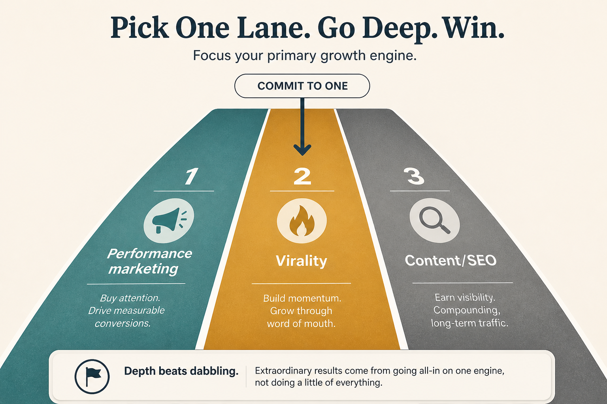

# Win one of three consumer growth lanes

**Source:** Lenny Rachitsky (@lennysan)
**Post:** https://x.com/lennysan/status/1313885961030234113

## What it claims

Successful consumer companies usually scale by excelling at one of three lanes: performance marketing, virality (WOM/invites), or content (SEO). Framework: (1) Validate cheaply — model-fit plus data. (2) Commit real cross-functional resources and let the lane shape the core roadmap. (3) Scale to outrun diminishing returns. Biggest mistake: spreading thin. One world-class lane wins.

## Why it matters for a PO

Discovery work often becomes a scatter of “growth tickets.” This forces an explicit lane choice and stops the PO from promising SEO + ads + virality with the same squad.

## 3 takeaways

1. Pick one lane; do not “do a bit of each.”
2. Validate with model-fit + data before staffing.
3. Commitment means the product roadmap changes, not a side growth experiment.

## Practice this week

Name your current primary lane in one line, list evidence it is working (or not), and freeze one in-flight initiative that belongs to a different lane.
