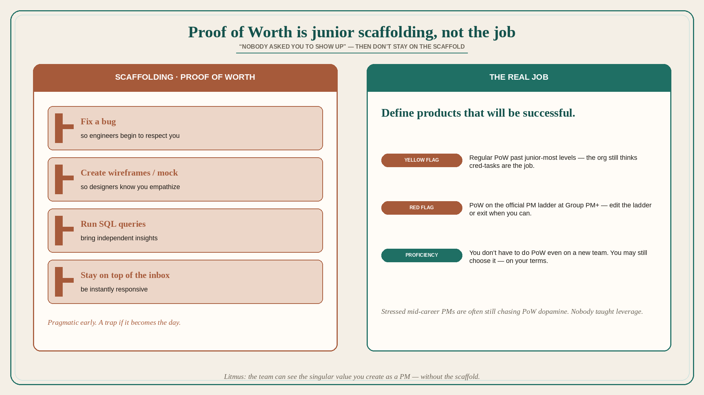

# Proof of Worth is junior scaffolding, not the job

**Source:** Shreyas Doshi (@shreyas)
**Post:** https://x.com/shreyas/status/1266797669088804865

## What it claims

Proof of Worth, a gentle product-management rant: when an early-career PM starts on a team, they might be told they must build credibility with the builders (eng, design, analytics…) — they must prove their worth. Fine advice, but it can go wrong long-term. PMs might be told that the PM title doesn’t itself give them the right to be in the room with the real product builders — “build cred.” It might not be fun to hear, but it’s a pragmatic perspective and isn’t necessarily wrong. How can the PM act on this? They are told: “You should fix a bug so engineers begin to respect you”; “You should create wireframes so your designers know you empathize with them”; “You should run SQL queries; bring independent insights”; “You should stay on top of everything; be instantly responsive.” They are being asked to provide Proof of Worth. Why? PM is a weird role. As Ken Norton famously said about PMs: “Remember friend, nobody asked you to show up.” So when you do show up, you will be more welcome if you can build instant cred. So far so fine. Trouble is, some PMs get forever engaged in Proof of Worth activities. They never learn that the main job is NOT to fill the day with Proof of Worth activities that provide short-term satisfaction and peer approval. The main job is to define products that will be successful. While at times these activities might be helpful in defining or building a successful product, they are usually not the activities that provide the greatest product-management leverage to the team, the product, the company. They also cause stress. Show a mid-career PM who is constantly stressed and overwhelmed with their tasks and you will show: a PM who was never taught what the REAL job is; a PM who doesn’t understand task leverage; a PM who is still doing some Proof of Worth tasks for the dopamine rush. As a PM, if your manager or team expects you to regularly do Proof of Worth tasks beyond the junior-most levels of product management, treat it as a yellow flag. If Proof of Worth tasks are an essential component of your company’s official PM Ladder at or beyond the Group PM level, treat it as a red flag — edit the PM ladder or exit the company when you can. A good litmus test of whether you’ve scaled higher degrees of PM proficiency is that you don’t have to do Proof of Worth tasks even when you join a new team or company: you’re so good at the core PM job that your team can readily see the singular value you create as a PM. And at that degree of proficiency, you might still at times choose to do Proof of Worth tasks — but on your own terms, because you know it’s sometimes the right thing to do for the product and the company. (TRA additional-resource tweets are pointers to other threads on the real job, LNO, and proficient-PM behavior; those were not unrolled here.)

## Why it matters for a PO

PO calendars fill with SQL, notes, ticket triage, and “I’ll just mock it.” That is Proof of Worth. It buys early cred and then becomes the job. The real job is defining products that will be successful. If the org’s ladder still requires PoW at senior/Group level, that is a red flag about what the org thinks a PO is for.

## 3 takeaways

1. Early “fix a bug / wireframe / SQL / instantly responsive” cred is pragmatic; making it the day is not the job.
2. Stressed mid-career PMs are often still chasing PoW dopamine because nobody taught leverage or the real job (define successful products).
3. Regular PoW past junior = yellow flag; PoW on the official ladder at Group PM+ = red flag. At proficiency you may still choose PoW on your terms.

## Practice this week

List this week’s tasks. Star every Proof of Worth item (bug, mock, SQL, notes, instant-response). Keep at most one, on purpose, if it actually helps the product. Replace two others with work that defines whether the product will be successful (who, alternative, outcome).
