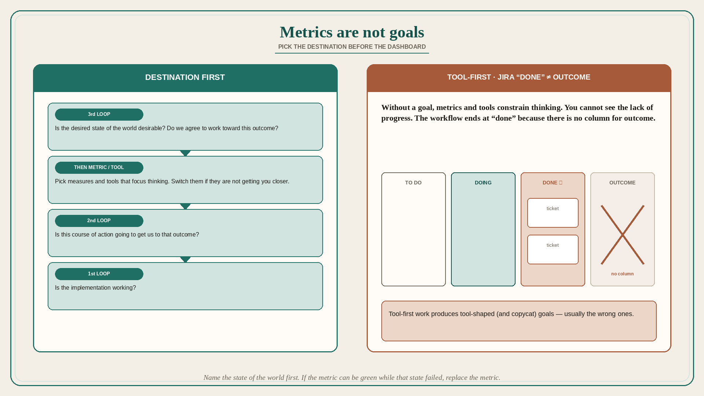

# Metrics are not goals; pick the destination before the dashboard

**Source:** Pavel A. Samsonov (@PavelASamsonov)
**Post:** https://x.com/PavelASamsonov/status/1620788948074385408

## What it claims

Do not confuse metrics with goals. The worst mistake in this genre is picking metrics before you have identified your goals — similar to picking tools before you know what you want to do with them. When you have a goal, you can pick metrics and tools that focus your thinking, and switch them out if they are not getting you closer. When you do not have a goal, all metrics and tools constrain your thinking, and you cannot see the lack of progress. With only metrics and tools, you cannot reflect on whether the work is getting you closer to the state of the world you want; the workflow ends at “done” and not “what was the outcome?” because there is no column for that in Jira. When you pick a tool before picking your goals, you end up setting goals that the tool is good at reaching: usually the wrong goals, and the same goals everyone else making the same mistake is pursuing. Order of work (pointing at the loops thread): start in the 3rd loop — is the thing we want to do desirable, do we agree to work toward this outcome? — then the 2nd — is this course of action going to get us to that outcome? — and only then the 1st — is the implementation working?

## Why it matters for a PO

Dashboards, Jira columns, and “the metric the tool reports” quietly become the goal. A PO who names the desired state of the world first can swap a metric; a PO who starts from the dashboard cannot see that nothing is progressing toward a destination that was never stated.

## 3 takeaways

1. Metrics without a prior goal constrain thinking and hide lack of progress.
2. Tool-first work produces tool-shaped (and copycat) goals.
3. Agree the outcome is desirable before you pick the course of action, and only then debug the implementation.

## Practice this week

For one in-flight epic, write the goal as a state of the world in one sentence *without* a metric. Then list the current metric/tool. If the metric would still look “green” while that state failed, replace the metric or park the epic until the destination is agreed.
