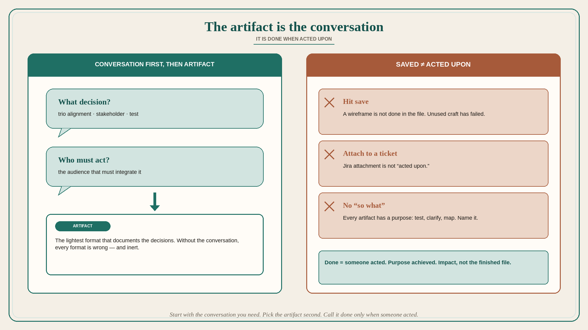

# The artifact is the conversation; it is done when acted upon

**Source:** Pavel A. Samsonov (@PavelASamsonov)
**Post:** https://x.com/PavelASamsonov/status/1585670469927190534

## What it claims

Do not start with “we need a user story” or “we need a wireframe.” Start with understanding the conversation you need to have, then select the correct artifact format to document the decisions made in that conversation. Without the conversation, all artifact formats are wrong. The artifact is in a conversation with its audience: they need to read it, understand it, and integrate what it documents into their mental model. Its power is making conversation outcomes consumable and actionable — but it needs the conversation. An artifact produced outside of a conversation is inert; the intended audience will not be able to act on it because it is not speaking to them. A wireframe is not done when you hit save in Figma; it is done when it is acted upon. A wireframe that is not acted upon has failed, regardless of craft — it is poor work and a bad design. “Acted upon” does not mean “attached to a Jira ticket.” Every design artifact is created for a purpose — user testing, clarifying concepts for stakeholders, mapping the experience within the team. A successful artifact has a “so what” that it achieved.

## Why it matters for a PO

Backlog items, PRDs, and PI boards are artifacts. Starting from “we need a story” produces inert tickets nobody can act on. Name the conversation (trio alignment, stakeholder decision, test) first, pick the lightest artifact that documents those decisions, and call it done only when someone acted — not when Jira says To Do.

## 3 takeaways

1. Conversation first, artifact second; without the conversation every format is wrong.
2. Saved ≠ done; an unused wireframe (or unused story) has failed.
3. Attach-to-Jira is not “acted upon”; name the purpose and the “so what.”

## Practice this week

Before writing the next story, write one line: the conversation this artifact must produce, and who must act. After refinement, check whether anyone acted. If not, the story is not done — change the format or have the conversation, do not add acceptance criteria.
