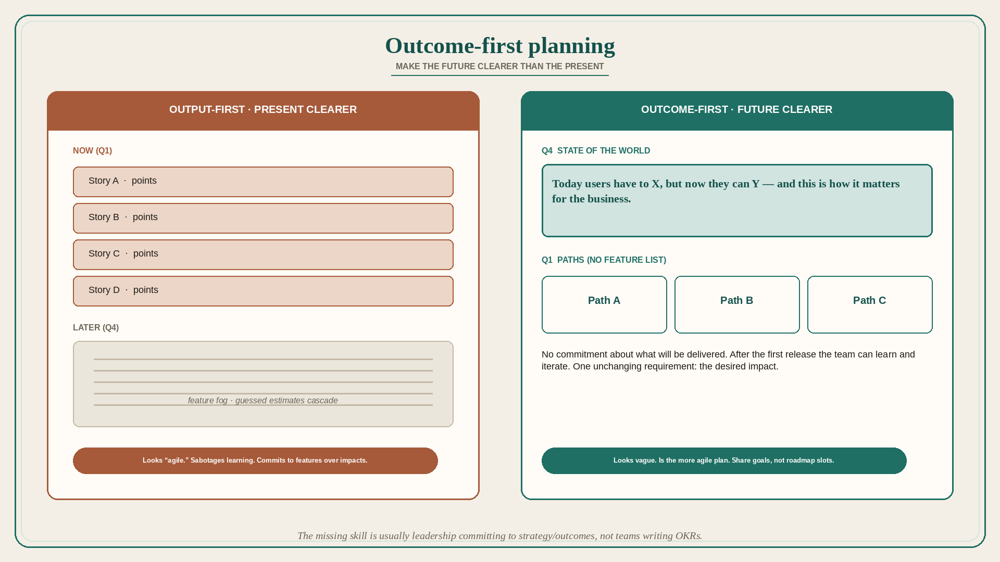

# Outcome-first planning: make the future clearer than the present

**Source:** Pavel A. Samsonov (@PavelASamsonov)
**Post:** https://x.com/PavelASamsonov/status/1569366431975804928

## What it claims

In output-first planning, present is clearer than future: we only know roughly what features we will build in Q4, but here are our Q1 user stories. In outcome-first planning, future is clearer than present: Q4 goals are set, and in Q1 we look for the right paths to reach them. Output-driven teams look more agile because they do not plan far ahead, but committing to features over impacts sabotages learning from what they release and pivoting. A feature-based roadmap also requires estimating (= guessing) time for bugs, rework, and catch-up; unexpected difficulty and cut-scope cascade problems down the entire year. The outcome-focused team is more agile because it makes no commitment about *what* it will deliver; there is no pressure to move to the next feature set after the first release, so the team can learn from the experiment and iterate. Starting from outcomes brings the entire team into the problem space at once; there is one unchanging requirement — the desired business impact. The skill gap is not that teams cannot set outcome objectives; it is that leaders will not commit to an explicit business strategy and therefore desired outcomes. A north star of the form “today users have to X but now they can Y, and this is how it matters for the business,” established before individual features, avoids premature solutioning. Cross-team collaboration changes: output-based is “roadmap full, pencil you in next year”; outcome-based is “we share goals ABC so we can join forces on options XYZ.”

## Why it matters for a PO

PI planning that locks Q1 stories while Q4 is a feature fog is output-first. A PO who can name the Q4 outcome, keep the requirement as impact, and refuse the cascade of guessed estimates is actually more agile than the team with a year of stories.

## 3 takeaways

1. Feature commitments that look “agile” block learning; outcome commitments that look vague are the more agile plan.
2. The missing skill is usually leadership committing to strategy/outcomes, not teams writing OKRs.
3. Work backwards from “today X, now Y, business Z” before features; share goals across teams instead of trading roadmap slots.

## Practice this week

Rewrite the next quarter as: the Q-end state of the world; three possible paths; no feature list. Strike one committed story that exists only because the present was clearer than the future. Share one outcome with a sister team and name a joint option.
