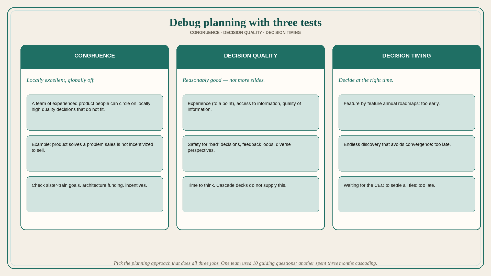

# Debug planning with congruence, decision quality, and timing

**Source:** John Cutler (@johncutlefish)
**Post:** https://x.com/johncutlefish/status/1573359303276302336

## What it claims

When starting annual planning, a strategy review, or deploying strategy, remember three tests: congruence, decision quality, decision timing. Congruence: a team of highly experienced product people can go in circles making *locally* high-quality decisions that are incongruent — e.g. product solves a problem that sales is not incentivized to sell. Decision quality: we want reasonably good decisions; what helps is experience (to a point), access to information, quality of information, safety for “bad” decisions, feedback loops, diverse perspectives, and time to think. Decision timing: decide at the right time. Deciding the next year’s roadmap feature by feature is too early. Endless discovery that avoids convergence is too late. Waiting for the CEO to settle all ties is too late. One team “plans” with a list of 10 guiding questions everyone should ask themselves about the work, all the time — for them that hits all three tests. An equally sized org spends three months of intense planning with cascaded goals, decks, and presentations: competing goals (incongruent), prescriptive roadmaps (hurts decision quality), premature convergence (bad timing). The #1 way to debug your planning process is to ask whether it inspires congruent decisions, high decision quality, and decisions at the right time; pick the approach that does all three jobs well.

## Why it matters for a PO

A locally excellent backlog can still be incongruent with sales incentives, architecture funding, or sister-train goals. Feature-by-feature annual roadmaps decide too early; waiting for the exec tie-break decides too late. The PO can debug the planning *process* with these three questions instead of adding another deck.

## 3 takeaways

1. Locally good decisions can still be incongruent across functions.
2. Decision quality needs information, safety, loops, diversity, and time to think — not more cascade slides.
3. Feature-level annual roadmaps are too early; endless discovery and CEO-as-tiebreaker are too late.

## Practice this week

Score the current planning cycle 0/1 on congruence, quality, timing. Write 5–10 guiding questions the trio should ask of every item (the “crazy” method that worked for Cutler’s example team). Drop one feature-level date from the annual view.
