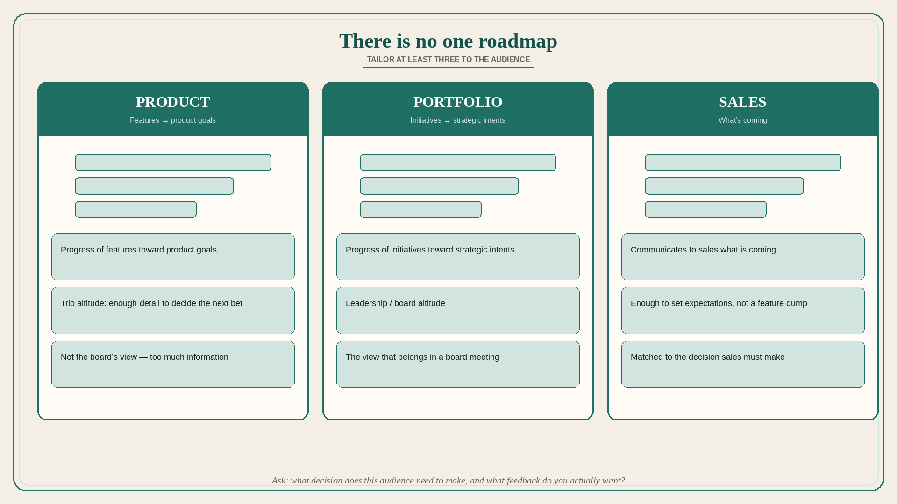

# There is no one roadmap; tailor at least three to the audience

**Source:** Melissa Perri (@lissijean)
**Post:** https://x.com/lissijean/status/1511047401330688011

## What it claims

There is no one roadmap that rules them all. Companies need at least three: (1) a Product Roadmap that communicates progress of features toward product goals; (2) a Portfolio Roadmap that communicates progress of initiatives toward strategic intents; (3) a Sales Roadmap that communicates to the sales team what is coming. Roadmaps at the end of the day are a communication tool and need to be tailored to the audience. Perri would not show the detailed level of a Product Roadmap to a board in a larger company — too much information; that is where a lot of board meetings go south. To get the right level, ask: what decisions does my audience need to make based on this information, and what is the right level of feedback I can get from this audience? Tailor the roadmap appropriately.

## Why it matters for a PO

One Jira plan shown to the trio, sales, and the board produces the wrong decisions and the wrong feedback. The PO’s job is three views of the same work: features→product goals, initiatives→strategic intents, and “what’s coming” for sales — each matched to the decision the audience must make.

## 3 takeaways

1. One roadmap cannot serve product, portfolio, and sales.
2. A board that sees feature-level detail is a meeting already going south.
3. Choose altitude from the decision the audience must make and the feedback you actually want.

## Practice this week

Split the current plan into three one-pagers: Product (features→goals), Portfolio (initiatives→intents), Sales (what’s coming). Take only the Portfolio view to the next leadership review. Note which questions disappear.
