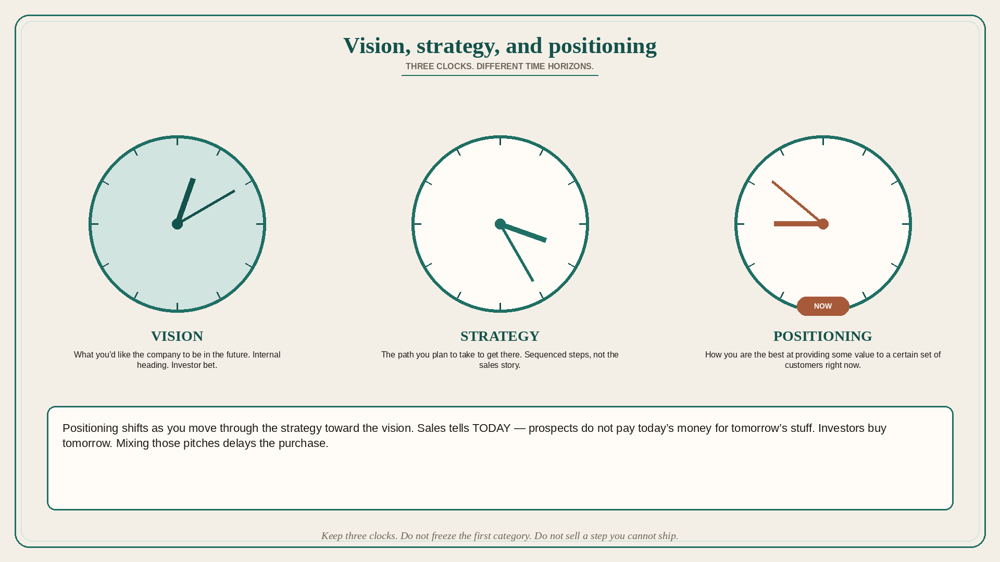

# Vision, strategy, and positioning are different time horizons

**Source:** April Dunford (@aprildunford)
**Post:** https://x.com/aprildunford/status/1460641946758791174

## What it claims

Vision, strategy, and positioning get mixed up, or treated as the same. Vision is what you’d like the company to be in the future — important internally and for investors betting on that future. Strategy is the path you plan to take to get there. Example: vision is to be a complete marketing platform for car dealerships; strategy is to start with an email platform, then a CRM, then bring marketing programs together on a platform. Positioning defines how you are the best at providing some value to a certain set of customers *right now* — the story marketing and sales tell about the current product in the current market. Positioning shifts as you move through the steps in the strategy toward the vision: first email for car dealerships, then CRM for car dealerships, finally a marketing platform for car dealerships. The sales story is tied to TODAY; it cannot get too far ahead of the current product or you give prospects a reason to delay the purchase — prospects do not pay today’s money for tomorrow’s stuff. Investors care a lot about vision (a bet on future state and potential to be a big business), which is why the sales pitch is generally quite different from the investor pitch: different time horizons, different definitions of “value.”

## Why it matters for a PO

Pitching the 3-year platform in a sales demo delays the deal; hiding the path from the team makes every sprint look like a random module. The PO keeps three clocks: vision for investors/internal heading, strategy as the sequenced path, positioning as the now-story that matches what can ship.

## 3 takeaways

1. Vision = future company; strategy = path; positioning = how you are best *right now*.
2. Positioning must move with the strategy steps; do not freeze the first category.
3. Sales tells today; investors buy tomorrow; mixing those pitches delays purchases.

## Practice this week

Write three sentences for one offering: vision, this-year strategy step, current positioning. Check the sales one-pager: if it sells a step you cannot ship, rewrite it to today.
