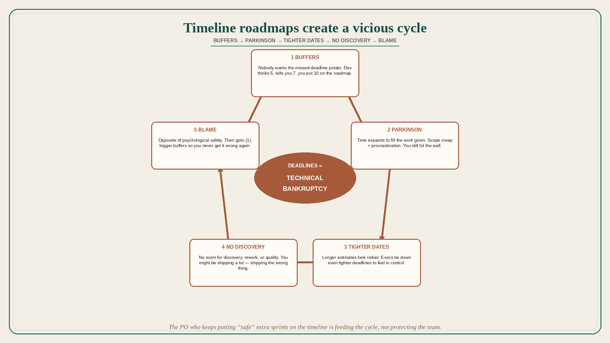

# Timeline roadmaps create a vicious cycle of buffers and blame

**Source:** Janna Bastow (@simplybastow)
**Post:** https://x.com/simplybastow/status/1321090934726119424

## What it claims

Timeline roadmaps produce a constant barrage of deadlines resulting in made-up release dates, development death marches, mismanaged expectations, missed market opportunities, building the wrong things, and sad product managers. That becomes a vicious cycle: (1) nobody wants to be caught holding the hot potato of a missed deadline, so bigger and bigger buffers are given (developer thinks 5 days, tells you 7, you put 10 on the roadmap); (2) time expands to fill the work given — Parkinson’s Law — a mix of scope creep and procrastination, so you always run up against deadlines no matter how far out they started; (3) longer estimates create longer, riskier-looking timelines, so execs get less comfortable giving freedom to build in lean ways and tie down even tighter deadlines to feel in control of resources and costs; (4) there is never room for discovery, rework, or quality, so the wrong things are built, problems are not solved, quality suffers — you might be shipping a lot, but you are shipping shit; (5) this leads to blame culture, the opposite of psychological safety, where no one feels safe making a misstep after being told off for missing the last deadline and launching features that solve nothing. Then goto (1): people give bigger buffers so they never get it wrong again. The loop runs until everyone quits and you are left with a pile of junk for a codebase. Deadlines = technical bankruptcy.

## Why it matters for a PO

Date-stamped PI roadmaps invite buffers, then tighter executive dates, then no discovery. The PO who keeps putting “safe” extra sprints on the timeline is feeding the cycle, not protecting the team.

## 3 takeaways

1. Buffers plus Parkinson plus tighter executive dates erase discovery and quality.
2. Shipping a lot on a timeline is compatible with shipping the wrong thing.
3. Blame culture and technical bankruptcy are the steady state of deadline roadmaps, not a personnel problem.

## Practice this week

Strip dates off one theme on the public roadmap; replace with the problem and the outcome. Where a buffer was added “to be safe,” write what discovery that buffer stole. Do not add a new date to compensate.
