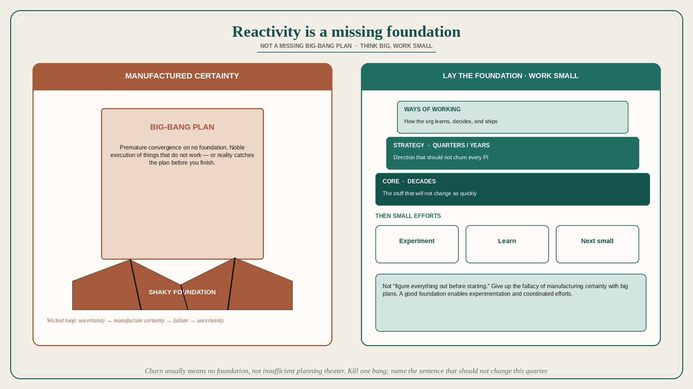

# Reactivity is a missing foundation, not a missing big plan

**Source:** John Cutler (@johncutlefish)
**Post:** https://x.com/johncutlefish/status/1599141255392694273

## What it claims

A company stuck in a terrible cycle — so reactive, nothing stable, nothing lasts, so much churn and pivoting, craving stability — signals a shaky foundation. Without a strong foundation, humans create *certainty* either by going into exploration mode to discover the foundation, or by manufacturing big-bang plans on top of no foundation. Exploration is hard and takes space/safety, time, care, patience, and attention, but it addresses the root. Manufacturing big-bang plans with no foundation will fail, 99% guaranteed. Without the right foundation you are forced into premature convergence: you either nobly execute things that do not work (failure later) or watch reality catch up with crafted plans and not even finish what you started. Wicked loop: uncertainty → manufacture certainty → failure → uncertainty. Camps form: people who see there is no foundation (ostracized); front-liners in a parade of bang-failures (cooked); frustrated leaders; owners of the big plans (burn out). Alternative: slow down, establish a foundation, undertake smaller efforts that are not as big-bang. Think big and work small. This is not “figure everything out before starting”; it is doing the work to lay the foundation and giving up the fallacy of manufacturing certainty with big plans. Foundation is both strategy etc. (the stuff that will not change as quickly) and ways of working — layered (core things that last decades, strategies that last quarters and years). A good foundation enables experimentation, learning about new foundations, and big coordinated efforts. When you lack a strong foundation, focus there; stop believing big projects will save the day.

## Why it matters for a PO

The request for “stability” often arrives as a demand for a bigger committed PI. That is manufacturing certainty on no foundation. The PO move is smaller efforts plus naming the missing foundation (strategy that will not churn quarterly, and a way of working), not another bang.

## 3 takeaways

1. Churn and pivoting usually mean no foundation, not insufficient planning theater.
2. Big-bang plans on no foundation fail almost always and produce four burnout camps.
3. Think big, work small: lay strategy and ways-of-working that last, then experiment.

## Practice this week

List the last three “pivots.” Mark each as exploration of foundation vs manufactured certainty. Kill or shrink one big-bang commitment. Write the one foundation sentence (strategy or working agreement) that should not change this quarter.
