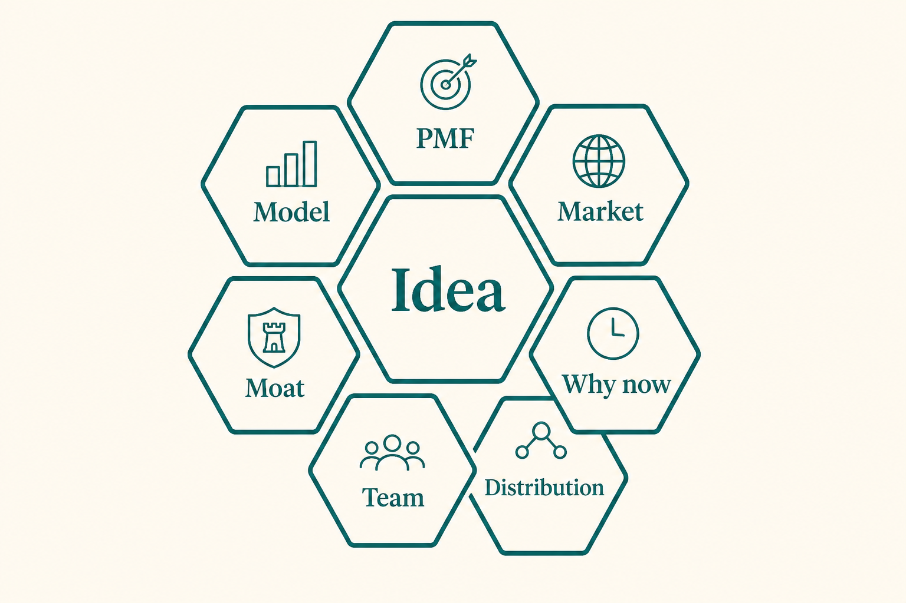

# Seven lenses for evaluating a product idea

**Source:** Lenny Rachitsky (@lennysan)
**Post:** https://x.com/lennysan/status/1275819005568118784

## What it claims

Before building or doubling down, score the idea on: PMF, market size, why now, distribution, team, moat, and business model. Every idea has been tried; timing is the question. Thiel: poor distribution — not product — is the number one cause of failure. Don’t be the best; be the only.

## Why it matters for a PO

POs inherit “the idea is obvious” from founders and sales. These seven lenses make a kill/continue conversation specific instead of taste-based.

## 3 takeaways

1. PMF without distribution still fails.
2. “Why now” is more important than novelty.
3. Unit economics and a plausible moat belong in the PRD, not the Series B.

## Practice this week

Score your current bet 1–5 on all seven lenses; the lowest two scores become discovery questions, not roadmap assumptions.
