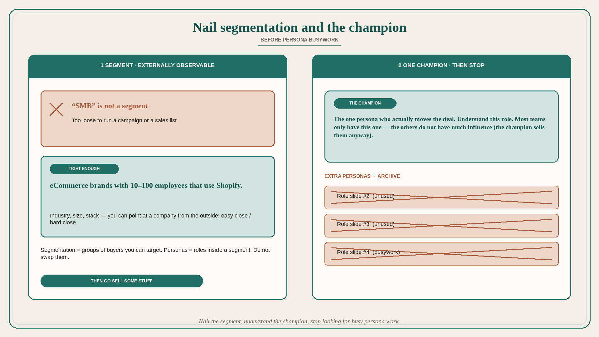

# Nail segmentation and the champion before persona busywork

**Source:** April Dunford (@aprildunford)
**Post:** https://x.com/aprildunford/status/1318287860840148992

## What it claims

Segmentation vs personas get muddled, especially in startups; startup folk spend way too much time on personas and not nearly enough on segmentation. Segmentation splits a market into distinct groups of buyers (restaurants → fast food, family casual, steak house, etc.). Personas represent buyers within a segment (owners, chefs, waitresses). In B2B more than one persona often influences a deal: you might sell to the VP Sales, the individual sales rep is a user, and the CEO signs the check. Segments need to be tightly defined for marketing/sales to target them; focus on the parts of the market that are easiest to sell to. “SMB” is not a useful segmentation; “eCommerce brands with 10–100 employees that use Shopify” is. Most startups Dunford talks to have weak segmentation and many defined personas; most of the time they really only have one — the key champion in the account — and the others do not have much influence (the champion does the job of selling them anyway). Sequence: first define segmentation tightly enough that marketing and sales can run campaigns around it; next make sure you are selling to the right champion and that you understand that persona. For most of the startups she has worked with, there was no need to go beyond that. Nail your segmentation, understand your champion, then stop looking for busy persona work and go sell some stuff.

## Why it matters for a PO

Persona slideware without an externally observable segment produces stories for imaginary roles. A PO should be able to point at a company from the outside and say “easy close / hard close,” and name the one champion who actually moves the deal, before commissioning more personas.

## 3 takeaways

1. Segmentation is groups of buyers you can target; personas are roles inside a segment — do not swap them.
2. “SMB” is not a segment; a segment is tight enough to run a campaign and a sales list.
3. Most teams need one champion persona after a tight segment; extra unused personas are busywork.

## Practice this week

Write the current segment in one externally observable sentence (industry, size, stack, or similar). Name the champion persona. Archive any other persona that does not influence the deal. Re-tag one backlog item to that segment+champion or drop it.
