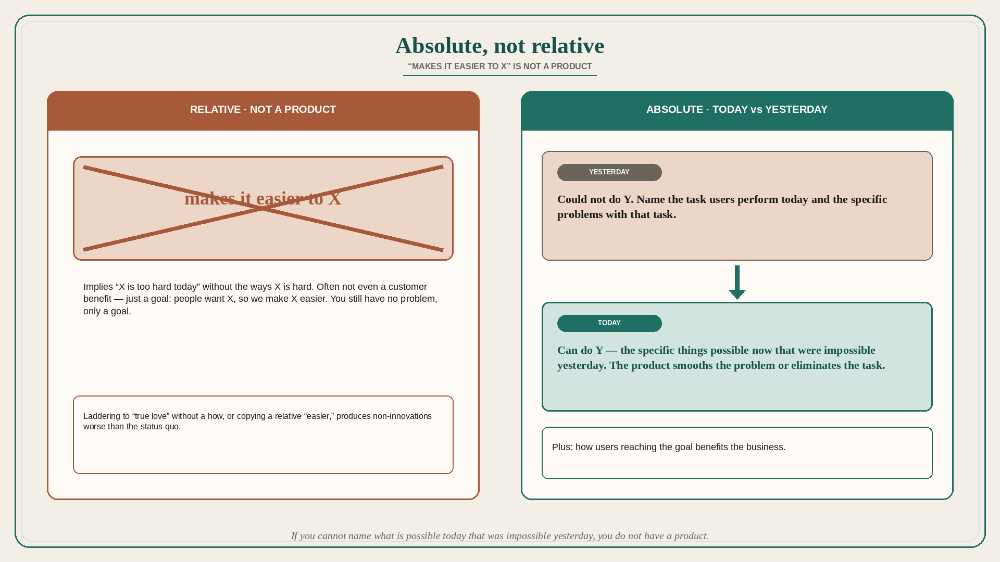

# Absolute not relative: “makes it easier to X” is not a product

**Source:** Pavel A. Samsonov (@PavelASamsonov)
**Post:** https://x.com/PavelASamsonov/status/1597660843746897922

## What it claims

Bonk anyone who says “feature X makes it easier to…” Use absolute, not relative, descriptions: the specific things you will be able to do today that you could not do yesterday. If you cannot articulate that, you do not have a product. “Makes it easier to X” is (in Samsonov’s four-part model, quoted not expanded here) the customer-benefit slot. It implies a problem — it is too hard to X today — but that is a useless observation without the ways in which X is hard, which you need for a solution. Often “easier to X” is not even a customer benefit; it is just a goal: people tell us they want X, so we will make X easier. Problem solved — except you do not have a problem, only a goal. The full statement needs: the end goal; the task users perform today to reach that goal and the specific problems with that task; and the way the new product smooths that problem or eliminates the task entirely — that last bit is what makes a product. Product strategy needs all of that, plus how users reaching the goal benefits the business; otherwise the team figures it out on the fly in two-week sprints, which does not work. The “people don’t want a drill, they want a hole” quip falls apart because strategy conversations ladder up (hang a picture → decorate → express themselves → find true love) and you still have to come back down to a solution. Dropping “as a user, I want to find true love” into Jira without aligning stakeholders on the hypothesis for how you help is pointless. Owning a drill’s main benefit is not “a hole”; it is “as many holes as you want, any time, with no notice” — a mission renting a drill or hiring a contractor would never satisfy. A hypothetical “Uber for drills” does not “make it easier to drill a hole → find true love”; it compromises that benefit by limiting latency and quantity of holes, and compared with what users can do today it is no innovation at all.

## Why it matters for a PO

Backlog language is full of “makes it easier to…” stories. Relative benefit hides that nobody named the current task, its specific failure, or what the product removes. A PO who can write the absolute (today you could not Y; after this you can Y) can kill Uber-for-drills epics that trade away the actual job.

## 3 takeaways

1. If you cannot name what is possible today that was impossible yesterday, you do not have a product.
2. “Easier to X” is a goal, not a problem; you still need today’s task and its specific failure.
3. Laddering to “true love” without a how, or copying a relative “easier,” produces non-innovations that are worse than the status quo.

## Practice this week

Rewrite one in-flight story without the word “easier.” Use: end goal; today’s task + specific problems; what we eliminate or smooth; business benefit of users reaching the goal. If any slot is empty, the story is not ready.
