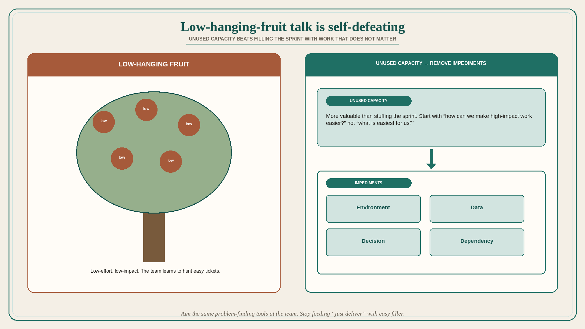

# Low-hanging-fruit talk is self-defeating

**Source:** Pavel A. Samsonov (@PavelASamsonov)
**Post:** https://x.com/PavelASamsonov/status/1569346028343795712

## What it claims

The conversation around shipping “low-hanging fruit” is self-defeating. If you prioritize low-effort, low-impact work, the team will optimize for low-effort, low-impact work. Instead of starting with “what is easiest for us?” start with “how can we make high-impact work easier?” PMs have a massive fear of “unused dev capacity” — but if the choice is between delivering low-impact work and reorganizing to ship high-impact work in the near future, unused capacity is far more valuable than using that capacity. Applying service design to the team’s practice, not only to the product, is powerful: the same tools that identify and resolve user problems are perfect for identifying and resolving dev-team problems. That also defangs leaders who “just deliver.” If product does not play their game and feed them low-effort work, and instead sets the goal of removing the impediments those leaders use as excuses, the self-sabotage becomes instantly visible.

## Why it matters for a PO

Sprint stuffing to “use the capacity” trains the trio to hunt easy tickets. A PO who will sit with unused capacity for a week to remove an impediment (environment, data, decision, dependency) is making high-impact work cheaper — and making “just deliver” leadership own the excuse.

## 3 takeaways

1. Low-hanging fruit is a training program for low-impact work.
2. Unused capacity beats filling the sprint with work that does not matter.
3. Aim the same problem-finding tools at the team’s impediments; stop feeding “just deliver” with easy filler.

## Practice this week

List the next three “quick wins.” Score impact independently of effort. Drop the lowest-impact one even if it would fill a hole in the sprint. Name one impediment that makes a high-impact item hard, and spend the freed capacity on removing it.
