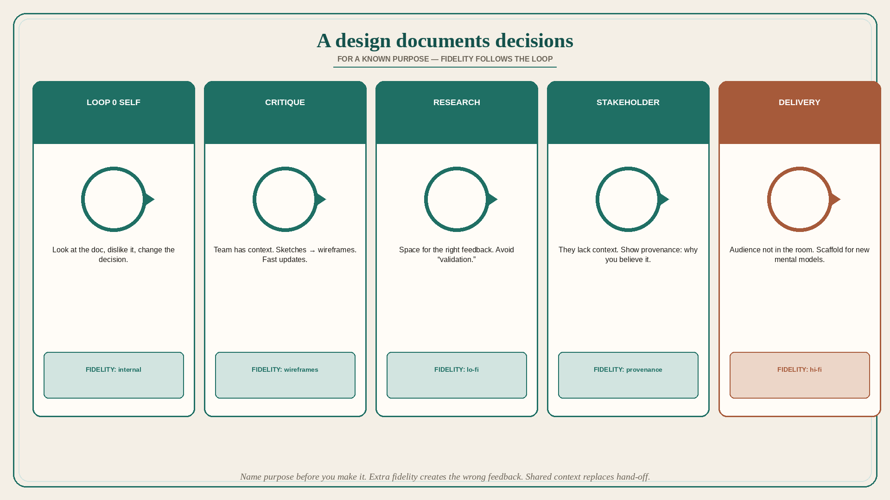

# A design is documentation of decisions for a known purpose

**Source:** Pavel A. Samsonov (@PavelASamsonov)
**Post:** https://x.com/PavelASamsonov/status/1607788796497612803

## What it claims

People think designers “make designs,” but a “design” is just an artifact documenting design decisions for some purpose. Most stakeholders request (and many designers make) artifacts without understanding what the artifact will be used for — making it useless. Figma et al. are documentation tools: they do not help you make design decisions, only visually document decisions you have made. “Loop zero” for designers is looking at that documentation, realizing you do not like it, and changing the decision. Loop one — critique — works the same way: when the designer’s internal process has stopped improving the artifact, show it to the rest of the team at slightly higher fidelity (sketches → wireframes). Why wireframes not mockups? The team has the same context and can fill gaps; low fidelity means updates can be extremely fast (up to real time) when the team makes new decisions after seeing the old ones. Overly high-fidelity critique artifacts create pitfalls: a false sense of completeness that draws trivial feedback (fonts) while key assumptions go unaddressed; feedback that cannot be implemented quickly; cross-functional teammates who cannot easily contribute. Know what you want from the critique and document accordingly; open critique or co-design with teammates is fine — for users, much harder. Research artifacts can and should be low fidelity for the same reason: space for the right level of feedback, and to avoid confirming assumptions (this is why Samsonov dislikes saying “validation”). The stakeholder demo is a different audience: they lack your context and may have their own assumptions and data. Be clear not only on the decisions but on their provenance — why you believe they are right — and on what you want stakeholders to take away; use fidelity to leave space for the feedback you want. Only delivery — for an audience that will not be in the room — truly needs high fidelity. It becomes a scaffold for new mental models (design outputs are memetic; the artifact is the medium). When structuring delivery documentation, ask what inputs the audience will need for their own workflows; they will not be able to ask you except through corporate broken telephone. This is why Samsonov does not believe in hand-off: including downstream decision-makers from the beginning short-circuits the diagram and drops tons of fidelity overhead (which is not “the work,” only documentation of the work). Recap: artifacts are documentation of decisions for a specific purpose you should know in advance; the artifact must fit the feedback loop that achieves that purpose; shared context replaces high fidelity.

## Why it matters for a PO

PRDs, story maps, and Figma links requested “for Jira” with no named purpose are useless. Match fidelity to the loop: trio critique = wireframes; research = lo-fi; stakeholder demo = provenance; delivery = hi-fi for people not in the room. Pull the implementer into the decision instead of handing off a mock.

## 3 takeaways

1. Name the purpose of the artifact before you make it; unknown purpose → useless.
2. Fidelity follows the loop (self / critique / research / stakeholders / delivery); extra fidelity creates the wrong feedback.
3. Shared context and early downstream people replace hand-off and fidelity overhead.

## Practice this week

For the next artifact, write one line: audience, purpose, loop (critique / research / stakeholder / delivery), fidelity cap. If the audience will be in the room, cut one fidelity level. Invite one downstream decision-maker to the conversation instead of a hand-off.
